# BIA na AWS — Roteiro híbrido (Console + terminal local)

> **Desafio Labs 3.0 · Preparação** — Desafios Fundamentais 1 a 4 + **Preparatório · Desafio 1** (Imersão AWS & IA: Agente de IA, MCP, EC2, Docker, IAM, RDS, ECR, ECS).
> O **Console da AWS cria a infraestrutura**; o **terminal local (Ubuntu no WSL)** roda scripts, build, deploy e túneis; a **bia-dev** roda migrations, deploy e o Kiro-CLI.

Roteiro de execução e consulta rápida. Cada passo responde: **onde** executar, **o que** fazer, **por que**, **como**, **o que o código/configuração resolve**, **resultado esperado** e **como validar** — com o print de evidência quando existe.

Fontes: `guia-desafio-preparatorio-1-hibrido.html` (base), `Aula Desafio 1.txt` (desafio atual), `guia-desafio-preparatorio-1.html` (versão só terminal), a pasta `Desafios/` (enunciados, guias anteriores e scripts do D4) e o projeto `bia/`.

---

## Sumário

- [0. Antes de começar](#0-antes-de-começar)
- [1. Conceitos em uma página](#1-conceitos-em-uma-página)
- [Fase 0 — A VM local (WSL) com as ferramentas](#fase-0--a-vm-local-wsl-com-as-ferramentas) · *Fundamentais D1 P1*
- [Fase 0B — BIA local com Docker e DBeaver](#fase-0b--bia-local-com-docker-e-dbeaver) · *Fundamentais D1 P2*
- [Fase 1 — Usuário IAM `formacao_aws` e `aws login`](#fase-1--usuário-iam-formacao_aws-e-aws-login) · *D2 P1*
- [Fase 2 — A rede: VPC `bia-vpc`](#fase-2--a-rede-vpc-bia-vpc)
- [Fase 3 — SGs da máquina de trabalho e key pair](#fase-3--sgs-da-máquina-de-trabalho-e-key-pair)
- [Fase 4 — Role `role-acesso-ssm` e permissões do usuário](#fase-4--role-role-acesso-ssm-e-permissões-do-usuário)
- [Fase 5 — Lançar a `bia-dev` por script e entrar via SSM](#fase-5--lançar-a-bia-dev-por-script-e-entrar-via-ssm)
- [Fase 5B — SSH × SSM na `bia-dev`](#fase-5b--ssh--ssm-na-bia-dev)
- [Fase 6 — Fork, clone e BIA na `bia-dev` (3001)](#fase-6--fork-clone-e-bia-na-bia-dev-3001)
- [Fase 7 — ECR: repositório e teste de comunicação](#fase-7--ecr-repositório-e-teste-de-comunicação) · *D2 P2 Dia 1*
- [Fase 8 — Build e push do WSL para o ECR](#fase-8--build-e-push-do-wsl-para-o-ecr) · *D2 P2 Dia 2*
- [Fase 9 — Kiro-CLI com o agente `bia`](#fase-9--kiro-cli-com-o-agente-bia) · **Preparatório D1 começa aqui**
- [Fase 10 — SGs de produção `bia-web` e `bia-db`](#fase-10--sgs-de-produção-bia-web-e-bia-db)
- [Fase 11 — RDS PostgreSQL `bia`](#fase-11--rds-postgresql-bia)
- [Fase 12 — Cluster ECS `cluster-bia`](#fase-12--cluster-ecs-cluster-bia)
- [Fase 13 — Task definition `task-def-bia`](#fase-13--task-definition-task-def-bia)
- [Fase 14 — Service `service-bia`](#fase-14--service-service-bia)
- [Fase 15 — Migrations no RDS a partir da `bia-dev`](#fase-15--migrations-no-rds-a-partir-da-bia-dev)
- [Fase 16 — IP do ECS, botão novo e `deploy.sh`](#fase-16--ip-do-ecs-botão-novo-e-deploysh)
- [Fase 17 — **Entrega 1**: print da BIA na porta 80](#fase-17--entrega-1-print-da-bia-na-porta-80)
- [Fase 18 — **Entrega 2**: diagnóstico do Kiro-CLI](#fase-18--entrega-2-diagnóstico-do-kiro-cli)
- [Fases 19–21 — Desafio 3: front no S3](#fases-1921--desafio-3-front-no-s3)
- [Fases 22–24 — Desafio 4: porteiro e túneis SSM](#fases-2224--desafio-4-porteiro-e-túneis-ssm)
- [Fase 25 — Pausar o que cobra por hora](#fase-25--pausar-o-que-cobra-por-hora)
- [Anexos](#anexos): deploy versionado · apagar tudo · troubleshooting · permissões finais · diferenças da aula · pontos a confirmar · material da pasta `Desafios/`

---

## 0. Antes de começar

### Onde cada ação acontece

| Etiqueta | Onde | Identidade |
|---|---|---|
| 🖥️ **CONSOLE** | Navegador, Console da AWS, região **us-east-1** | Usuário administrador da conta |
| 💻 **WSL** | Terminal Ubuntu 24.04 do seu PC (`usuario@PC:~$`) | `formacao_aws` (credencial temporária do `aws login`) |
| ☁️ **BIA-DEV** | EC2 `bia-dev`, via sessão SSM (`[ec2-user@ip-… bia]$`) | Role `role-acesso-ssm` |
| 🤖 **KIRO** | Dentro do `kiro-cli chat --agent "bia"` na bia-dev | Role da bia-dev |
| 🌐 **NAVEGADOR / GITHUB** | Navegador do Windows | Sua conta GitHub / nenhum |

### Nomes usados no roteiro

| Recurso | Nome | Recurso | Nome |
|---|---|---|---|
| Região | `us-east-1` | ECR | `bia` |
| Usuário IAM | `formacao_aws` | Cluster ECS | `cluster-bia` |
| Role das EC2 | `role-acesso-ssm` | Task definition | `task-def-bia` |
| VPC | `bia-vpc` (10.0.0.0/16) | Service | `service-bia` |
| EC2 de trabalho | `bia-dev` | RDS | `bia` (db.t3.micro) |
| SGs | `bia-dev`, `bia-dev-ssh`, `bia-web`, `bia-db`, `bia-porteiro` | Bucket (D3) | `bia-assets-<ACCOUNT_ID>` |
| Bastion (D4) | `porteiro-bia` | Portas locais (D4) | 5433 (RDS) · 3002 (BIA) |

### Placeholders — substitua pelos seus valores, nunca os versione

`<ACCOUNT_ID>` · `<SEU_NOME>` · `<SEU_EMAIL>` · `<SEU_EMAIL_GITHUB>` · `<SEU_USUARIO_GITHUB>` · `<SEU_USUARIO_WINDOWS>` · `<SENHA_RDS>` · `<ENDPOINT_RDS>` · `<IP_PUBLICO_BIA_DEV>` · `<IP_PUBLICO_ECS>` · `<NOME_UNICO_DO_BUCKET>` · `<TEXTO_DO_SEU_BOTAO>`

### Arquitetura final

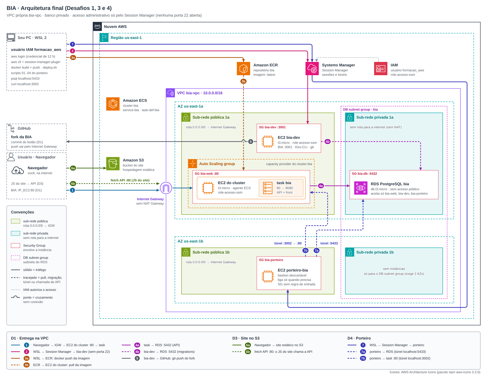

Fluxo do Preparatório D1: **Navegador → IGW → EC2 do cluster :80 → task (80→8080) → RDS :5432**. O WSL empurra a imagem para o ECR; o ECS puxa. A bia-dev (via SSM, sem porta 22) roda migrations e o Kiro.

### Custos

- **Cobram por hora:** bia-dev, porteiro, EC2 do cluster (t3.micro), RDS db.t3.micro + disco, cada IPv4 público.
- **Cobram por GB:** S3 e ECR (centavos).
- **Não cobram:** VPC, SGs, roles, usuários. **Não há NAT Gateway** (propositalmente).
- Parar de pagar: [Fase 25](#fase-25--pausar-o-que-cobra-por-hora) (pausar) ou [Anexo B](#anexo-b--apagar-tudo) (apagar).

### Budget de custo mensal — 🖥️ CONSOLE (uma vez, antes de criar recursos)
- **Por quê:** a aula e o `Desafios/Desafio 1.txt` configuram um budget logo no início; ele avisa por e-mail antes de a fatura surpreender (vários recursos daqui cobram por hora).
- **Caminho:** Billing and Cost Management › **Budgets** › *Create budget* › template **Monthly cost budget** → nome, valor mensal que você aceita gastar e `<SEU_EMAIL>` para os alertas → *Create budget*.
- **Validar:** o budget aparece na lista de Budgets. *(O valor do limite não é definido nas aulas — escolha o seu.)*

### Ordem dos desafios e mapa das entregas

Cada desafio usa o que o anterior deixou pronto. O Preparatório D1 (F9–F18) vem **antes** do Desafio 3, porque D3 e D4 usam a API no ECS e o RDS que ele cria.

| Desafio | Item oficial | Onde |
|---|---|---|
| Fund. D1 · P1 | VM Ubuntu 24.04; VS Code, DBeaver, git, Docker, AWS CLI, SAM, extensão GitHub PR autenticada; pasta `formacaoaws` | F0 |
| Fund. D1 · P2 | BIA com Docker persistindo dados; DBeaver no banco da BIA | F0B |
| Fund. D2 · P1 | VM conectada à conta (usuário IAM); bia-dev lançada; conexão por SSH **e** SSM | F1–F5B |
| Fund. D2 · P2 | Dia 1: bia-dev por script, permissões IAM no usuário, testar ECR · Dia 2: build e push da VM | F4–F8 |
| **Preparatório D1** | **Print da BIA na porta 80 com seu e-mail e botão alterado** | **F17** |
| **Preparatório D1** | **Diagnóstico do Kiro-CLI: projeto rodando corretamente no ECS** | **F18** |
| Fund. D3 | Bucket com site estático; script com URL da API por argumento; sync; registro salvo pelo site | F19–F21 |
| Fund. D4 | Porteiro na zona b; túnel RDS 5433 + INSERT; túnel BIA 3002; script que para o porteiro | F22–F24 |

> Replay e link de entrega do Preparatório D1 ficam na área de membros (aviso na comunidade). Prazo informado na aula: **até terça** — confirme a data.

### Mapa de evidências

Cada print em `imagens/` comprova uma etapa concluída (Account ID, IDs de recursos, IPs públicos, endpoint e URIs já estão mascarados). Na ordem de execução:

| Fase | Imagem | O que comprova |
|---|---|---|
| [1.1](#fase-1--usuário-iam-formacao_aws-e-aws-login) | `IAM_users.png` | Usuário `formacao_aws` criado na conta |
| [2.1](#fase-2--a-rede-vpc-bia-vpc) | `VPC_bia.png` | `bia-vpc` *Available* (ao lado da VPC default) |
| [2.3](#fase-2--a-rede-vpc-bia-vpc) | `Subnets.png` | 4 subnets (públicas e privadas, 1a/1b) e auto-assign de IPv4 público ligado |
| [3](#fase-3--sgs-da-máquina-de-trabalho-e-key-pair) · [10](#fase-10--sgs-de-produção-bia-web-e-bia-db) | `Security_group.png` | SGs `bia-dev`, `bia-web` e `bia-db` na `bia-vpc` *(estado após a F10)* |
| [4](#fase-4--role-role-acesso-ssm-e-permissões-do-usuário) · [10](#fase-10--sgs-de-produção-bia-web-e-bia-db) | `IAM_policy.png` | `formacao_aws` com a inline `PermissaoScriptsIAM`, `AmazonEC2FullAccess` e as policies de RDS/ECS *(estado após a F10)* |
| [5](#fase-5--lançar-a-bia-dev-por-script-e-entrar-via-ssm) | `EC2_bia-dev.png` | `bia-dev` t3.micro *Running*, 3/3 checks, IP privado da `bia-vpc` |
| [6](#fase-6--fork-clone-e-bia-na-bia-dev-3001) | `Navegador_porta_3001_docker.png` | BIA rodando na bia-dev (3001) e gravando tarefa; botão original |
| [7](#fase-7--ecr-repositório-e-teste-de-comunicação) | `ECR_criacao.png` | Repositório privado `bia` no ECR |
| [8](#fase-8--build-e-push-do-wsl-para-o-ecr) | `ECR_repositories.png` | Imagem `latest` (~215 MB) enviada pelo push |
| [9](#fase-9--kiro-cli-com-o-agente-bia) | `Kiro_CLI.png` | Kiro autenticado na bia-dev, agente `bia` em `~/bia` |
| [11](#fase-11--rds-postgresql-bia) | `RDS_banco_dados.png` | RDS `bia` PostgreSQL *Available* em us-east-1a |
| [12](#fase-12--cluster-ecs-cluster-bia) | `ECS_clusters.png` | `cluster-bia` criado com 1 EC2 registrada |
| [14](#fase-14--service-service-bia) · [16](#fase-16--ip-do-ecs-botão-novo-e-deploysh) | `ECS_deploy.png` | `service-bia` 1/1 running, `task-def-bia:1`, deploy *Success*, rolling 0%/100%, circuit breaker off |
| [**17**](#fase-17--entrega-1-print-da-bia-na-porta-80) | `BIA_na_porta_80.png` | **Entrega 1** — BIA na porta 80 com e-mail e botão **Salvar tarefa** |
| [**18**](#fase-18--entrega-2-diagnóstico-do-kiro-cli) | `Diagnostico_do_Kiro-CLI.png` | **Entrega 2** — relatório do Kiro sobre ECS, task, RDS e API |
| [19.2](#fases-1921--desafio-3-front-no-s3) | `S3_Buckets_1.png` | Bucket `bia-assets-…` em us-east-1 |
| [21.2](#fases-1921--desafio-3-front-no-s3) | `S3_Buckets_2.png` | Build do React sincronizado (`index.html`, `assets/`…) |
| [21.3](#fases-1921--desafio-3-front-no-s3) | `S3_Buckets_BIA_navegador.png` | Registro "Desafio 3 - salvo pelo site do S3" |
| [23–24](#fases-2224--desafio-4-porteiro-e-túneis-ssm) | `BIA_tunel_porteiro.png` | Registro manual do INSERT pelo túnel (F23) visível pela BIA na 3002 (F24) |
| Visão geral | `arquitetura-final-bia-v2.svg` | Arquitetura construída pelos quatro desafios |

**Etapas sem print** — comprove pelo comando de validação do próprio passo: F0/0B (ferramentas, BIA local, DBeaver), 5B (SSH × SSM), 13 (task definition), 15 (migrations no RDS), 20 (scripts do S3), 22 (porteiro lançado), 25 (pausa dos recursos).

---

## 1. Conceitos em uma página

| | **Security Group** | **IAM Role** |
|---|---|---|
| Controla | Tráfego de rede (firewall stateful) | Permissões/autorização |
| Pergunta | *"Quem pode chegar até mim pela rede?"* | *"O que eu posso fazer na AWS?"* |
| Na BIA | `bia-dev` abre a 3001; `bia-web` abre a 80; `bia-db` aceita 5432 só de SGs | `role-acesso-ssm` deixa a EC2 falar com SSM, ECR, ECS, RDS |

**SSM × SSH**

| | SSH | SSM Session Manager |
|---|---|---|
| Autenticação | Arquivo `.pem` | IAM (usuário/role) |
| Porta de entrada | 22 aberta | **Nenhuma** |
| Direção | Inbound na EC2 | Outbound da EC2 (agente → SSM, HTTPS 443) |
| Auditoria | Logs locais | CloudTrail |

**ECS:** *Cluster* = poder computacional (EC2 via ASG + Launch Template, criados por um stack CloudFormation) → *Task definition* = a "receita" (imagem, CPU, memória, portas, variáveis — parecida com um `compose.yml`) → *Service* = mantém N tasks rodando e as repõe → *Task* = o container em execução. Ordem de criação: **cluster → task definition → service**.

**Por que EC2 e não Fargate:** com a mesma capacidade, Fargate custa ~3× mais (aula).

### Entrar e sair da bia-dev (vale a partir da Fase 5)

| Prompt | Onde você está | O que fazer |
|---|---|---|
| `usuario@PC:~$` | WSL (seu PC) | Abrir sessão SSM (bloco abaixo) |
| `[ssm-user@… bin]$` | bia-dev como `ssm-user` | `sudo su - ec2-user` |
| `[ec2-user@… ~]$` | bia-dev, home | `cd ~/bia` |
| `[ec2-user@… bia]$` | pasta do projeto | Lugar de `git`, `docker compose`, `kiro-cli` |

```bash
# 💻 WSL — reconectar
source ~/DESAFIO1/desafio1.sh
BIA_DEV_ID=$(aws ec2 describe-instances --filters "Name=tag:Name,Values=$BIA_DEV" "Name=instance-state-name,Values=running" \
  --query 'Reservations[0].Instances[0].InstanceId' --output text); echo "$BIA_DEV_ID"
aws ssm start-session --target "$BIA_DEV_ID" --document-name AWS-StartInteractiveCommand --parameters command="bash -l"
# ☁️ BIA-DEV
sudo su - ec2-user
cd ~/bia
# sair: exit (volta ao ssm-user) + exit (volta ao WSL)
```

> Sair da sessão **não** para os containers: use `docker compose down` antes. A sessão cai após ~20 min parada.

---

# Fundamentais · Desafio 1

## Fase 0 — A VM local (WSL) com as ferramentas

**Objetivo:** o Ubuntu 24.04 do WSL faz o papel da "VM". Nele: git, Docker (via Docker Desktop), AWS CLI, plugin SSM, Node, psql e SAM. No Windows: VS Code e DBeaver.

### 0.1 Abrir o terminal Ubuntu — 🪟 WINDOWS
- **Como:** `Win + R` → `wt` → seta ˅ ao lado do `+` → **Ubuntu**. Nova aba: `Ctrl + Shift + T` (o D4 usa três abas).
- **Resultado:** `usuario@MAQUINA:~$`.

### 0.2 Conferir e instalar ferramentas — 💻 WSL
- **Por quê:** todo comando local do roteiro é Bash e depende dessas ferramentas.

```bash
aws --version; session-manager-plugin --version; node -v && npm -v; psql --version; git --version
```

Instale **só** o que responder `command not found`:

```bash
# AWS CLI v2
sudo apt-get install -y curl unzip
curl "https://awscli.amazonaws.com/awscli-exe-linux-x86_64.zip" -o /tmp/awscliv2.zip
unzip -q /tmp/awscliv2.zip -d /tmp && sudo /tmp/aws/install
# Session Manager Plugin (abre sessões e túneis SSM)
curl -o /tmp/smp.deb "https://s3.amazonaws.com/session-manager-downloads/plugin/latest/ubuntu_64bit/session-manager-plugin.deb"
sudo dpkg -i /tmp/smp.deb
# Node 24 (build do React no D3)
curl -sL https://deb.nodesource.com/setup_24.x -o /tmp/nodesource_setup.sh
sudo bash /tmp/nodesource_setup.sh && sudo apt-get install -y nodejs
# Cliente psql (D4)
sudo apt-get update && sudo apt-get install -y postgresql-client
```

- **Validar:** as cinco ferramentas respondem com versão.

### 0.3 Integrar o Docker Desktop ao Ubuntu — 🪟 WINDOWS + 💻 WSL
- **Por quê:** no WSL quem roda o Docker é o Docker Desktop; o Ubuntu só precisa enxergá-lo (build e push do D2 Dia 2).
- **Como:** Docker Desktop → *Settings* → *Resources* → *WSL Integration* → marcar **Enable integration with my default WSL distro** e ligar **Ubuntu** → *Apply & restart*.
- **Validar:** `docker version --format '{{.Server.Version}}' && docker ps` → versão + cabeçalho `CONTAINER ID …`.

### 0.4 Clonar a BIA no disco do Linux — 💻 WSL
- **Por quê:** no disco do Linux o clone vem com quebra de linha **LF**; em CRLF (`/mnt/c`) o Bash falha com `$'\r': command not found`.

```bash
git clone https://github.com/henrylle/bia ~/bia
file ~/bia/scripts/criar_role_ssm.sh     # não pode aparecer "with CRLF line terminators"
```

> O **fork** com os seus commits nasce na Fase 6, dentro da bia-dev.

### 0.5 Conferir Ubuntu 24.04 — 💻 WSL
`lsb_release -a` → `Release: 24.04`. Outra versão? No PowerShell: `wsl --install Ubuntu-24.04` e refaça a Fase 0 nela.

### 0.6 Configurar o git — 💻 WSL
```bash
git config --global user.name "<SEU_NOME>"
git config --global user.email "<SEU_EMAIL_GITHUB>"
git config --global --list
```
**Por quê:** sem nome/e-mail o git recusa o commit. (A bia-dev recebe a própria configuração na Fase 6.)

### 0.7 Instalar o AWS SAM CLI — 💻 WSL
```bash
curl -L https://github.com/aws/aws-sam-cli/releases/latest/download/aws-sam-cli-linux-x86_64.zip -o /tmp/sam.zip
unzip -q /tmp/sam.zip -d /tmp/sam-installation && sudo /tmp/sam-installation/install
sam --version
```
**O que resolve:** `-L` segue o redirecionamento do `latest`; o `install` cria `/usr/local/bin/sam`. Já instalado? `sudo /tmp/sam-installation/install --update`. *(Item do D1 P1; nenhuma fase o usa depois.)*

### 0.8 DBeaver Community — 🪟 WINDOWS
`https://dbeaver.io/download` → *DBeaver Community* → *Windows (installer)* → instalação padrão. Resultado: DBeaver abre com o *Database Navigator* vazio.

### 0.9 Pasta `~/formacaoaws` no VS Code ligado ao WSL — 🪟 + 💻
- VS Code → Extensions (`Ctrl+Shift+X`) → **WSL** (Microsoft) → *Install*.
```bash
mkdir -p ~/formacaoaws && cd ~/formacaoaws && code .
```
- **Resultado:** canto inferior esquerdo `WSL: Ubuntu-24.04`; Explorer `FORMACAOAWS [WSL: …]`.

### 0.10 Extensão GitHub Pull Requests autenticada — 🪟 VS Code
Extensions → **GitHub Pull Requests** (autor GitHub) → *Install (in WSL)* → ícone GitHub na barra lateral → *Sign in* → *Allow* → no navegador, *Authorize Visual Studio Code* → *Open Visual Studio Code*.
- **Validar:** Accounts (ícone de pessoa) mostra `<SEU_USUARIO_GITHUB> (GitHub)`.

**✅ Entrega D1 · P1:** Ubuntu 24.04 (0.5) · ferramentas (0.2–0.8) · pasta `~/formacaoaws` (0.9) · extensão autenticada (0.10).

---

## Fase 0B — BIA local com Docker e DBeaver

### 0B.1 Subir a BIA com `docker compose` — 💻 WSL
- **Por quê:** o D1 P2 pede a BIA rodando com Docker; o `compose.yml` sobe **server** (build do `Dockerfile`), **database** (PostgreSQL) e **redis**.

```bash
cd ~/bia
docker compose up -d
docker compose ps
curl -s http://localhost:3001/api/versao; echo
```

| Trecho do `compose.yml` | O que resolve |
|---|---|
| `3001:8080` (server) | porta do PC : porta do container |
| `5433:5432` (database) | só para o DBeaver; a app usa `database:5432` na rede interna do Docker |
| `db:/var/lib/postgresql/data` | volume nomeado: os dados ficam **fora** do container |

- **Resultado:** 3 containers `Up` e `Bia 4.3.0`. `port is already allocated`? Outro processo usa 3001/5433.

### 0B.2 Criar a tabela e cadastrar uma tarefa — 💻 WSL + 🌐
- **Por quê:** o banco `bia` nasce vazio; a **migration** cria a tabela `Tarefas` (estrutura versionada em código — *up* aplica, *down* desfaz).

```bash
docker compose exec server bash -c 'npx sequelize db:migrate'
docker compose exec database psql -U postgres -d bia -c '\dt'
```
Navegador: `http://localhost:3001` → tarefa `teste local` → **Add New Task**.
- **Resultado:** `criar-tarefas: migrated`, tabelas `SequelizeMeta` e `Tarefas`, tarefa na lista.

### 0B.3 Provar a persistência — 💻 WSL
```bash
docker volume ls | grep bia
docker compose down && docker compose up -d
docker compose exec database psql -U postgres -d bia -c "SELECT titulo FROM \"Tarefas\" WHERE titulo = 'teste local';"
```
- **O que resolve:** `down` apaga containers, **não** o volume `bia_db`. A tarefa volta sem repetir a migration. (`down -v` apagaria o banco.) Aspas em `"Tarefas"` são obrigatórias (T maiúsculo).

### 0B.4 DBeaver no banco da BIA — 🪟 DBeaver
*Database* → *New Database Connection* → **PostgreSQL** → Host `localhost` · Port `5433` · Database `bia` · Username/Password conforme o `compose.yml` (credenciais **só de desenvolvimento**, nunca as do RDS) → *Test Connection* (baixe o driver se pedir) → *Finish*.
- **Validar:** `bia › Schemas › public › Tables › Tarefas › Data` mostra `teste local`.

### 0B.5 Derrubar a BIA local — 💻 WSL
```bash
cd ~/bia && docker compose down
```
**Por quê:** libera a 5433 que o túnel do D4 vai usar e a memória do PC.

**✅ Entrega D1 · P2:** BIA com Docker e dado persistido (0B.1–0B.3) · DBeaver conectado (0B.4).

---

# Fundamentais · Desafio 2

## Fase 1 — Usuário IAM `formacao_aws` e `aws login`

### 1.1 Criar o usuário com três policies iniciais — 🖥️ CONSOLE (administrador)
- **Por quê:** o terminal agirá como este usuário. O `aws login` exige acesso ao Console e a policy `SignInLocalDevelopmentAccess`. As demais permissões entram **aos poucos, a cada AccessDenied** (mínimo privilégio progressivo).
- **Caminho:** IAM › Users › **Create user**

| Tela | Campo | Valor | Por quê |
|---|---|---|---|
| Specify user details | User name | `formacao_aws` | Nome usado pelo `aws login` |
| | Provide user access to the AWS Management Console | ✔ | Exigência do `aws login` |
| | User type | *I want to create an IAM user* | Usuário IAM comum |
| Set permissions | Permissions options | *Attach policies directly* | |
| | Policies | `SignInLocalDevelopmentAccess`, `AmazonSSMFullAccess`, `AmazonEC2ContainerRegistryFullAccess` | login · sessões/túneis SSM · push no ECR |
| Retrieve password | Console password | *Show* / *Download .csv* | **Aparece uma única vez** |

Teste o login do novo usuário numa janela anônima (sign-in URL da conta) e troque a senha no 1º acesso.
- **Resultado:** aba *Permissions* com 4 policies (as 3 + `IAMUserChangePassword`, anexada automaticamente).

📸 **Evidência** — usuários da conta:

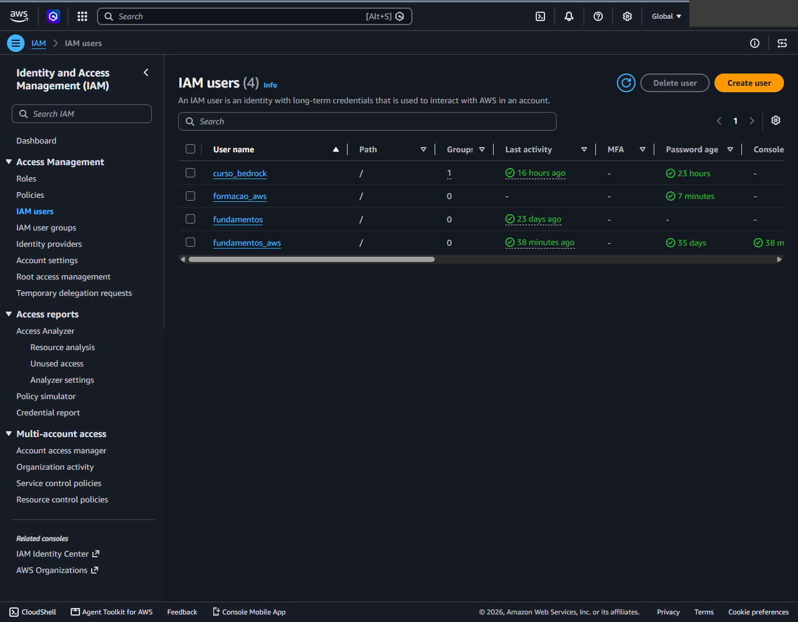

### 1.2 `aws login` e conferência de identidade — 💻 WSL
- **Por quê:** credencial temporária (12 h), sem chave permanente no disco.

```bash
aws login --profile formacao_aws                      # confirme us-east-1; entre como formacao_aws (não root)
export AWS_PROFILE=formacao_aws AWS_DEFAULT_REGION=us-east-1 AWS_PAGER=""
aws sts get-caller-identity                           # autenticação: quem sou
aws ecr describe-repositories --region us-east-1      # autorização: o que posso
```

| Trecho | O que resolve |
|---|---|
| `export AWS_PROFILE=…` | Scripts sem `--profile` passam a usar o `formacao_aws` (sem isso, "a VPC não existe") |
| `"repositories": []` | Lista vazia = **sucesso** (sem a policy, `AccessDeniedException`) |

- **Resultado:** `Arn` termina em `user/formacao_aws`. Anote o `<ACCOUNT_ID>` (fora do repositório).
- `gio: Operation not supported`? Copie a URL impressa para o navegador do Windows. `ExpiredToken` após 12 h? Refaça o `aws login`.

### 1.3 Arquivo de variáveis do pipeline — 💻 WSL
- **Por quê:** `export` vale só na aba; o D4 usa três abas. Este arquivo é recarregado com `source`.

```bash
mkdir -p ~/DESAFIO1
cat > ~/DESAFIO1/desafio1.sh <<'FIM'
export AWS_PROFILE=formacao_aws
export AWS_DEFAULT_REGION=us-east-1
export AWS_PAGER=""
export BIA_DIR=$HOME/bia
export BIA_VPC=bia-vpc
export BIA_DEV=bia-dev
export RDS_ID=bia
export ECR_REPO=bia
export CLUSTER=cluster-bia
export SERVICE=service-bia
export TASK_FAMILY=task-def-bia
export BUCKET_NAME=PREENCHER
export PORTEIRO=porteiro-bia
export PORTA_RDS_LOCAL=5433
export PORTA_BIA_LOCAL=3002
FIM
ACCOUNT_ID=$(aws sts get-caller-identity --query Account --output text)
sed -i "s#^export BUCKET_NAME=.*#export BUCKET_NAME=bia-assets-$ACCOUNT_ID#" ~/DESAFIO1/desafio1.sh
source ~/DESAFIO1/desafio1.sh && echo "$BIA_DEV | $CLUSTER | $BUCKET_NAME | $PORTEIRO"
# opcional: carregar em toda aba nova
grep -qxF 'source ~/DESAFIO1/desafio1.sh' ~/.bashrc || echo 'source ~/DESAFIO1/desafio1.sh' >> ~/.bashrc
```
- **O que resolve:** o nome de bucket precisa ser único no mundo; `bia-assets-<ACCOUNT_ID>` garante isso.
- **Resultado:** `bia-dev | cluster-bia | bia-assets-<ACCOUNT_ID> | porteiro-bia`.

---

## Fase 2 — A rede: VPC `bia-vpc`

> **Por que uma VPC própria (diferente da aula, que usa a *default*)?** Para separar **subnets públicas** (com rota à internet: EC2 de trabalho e do cluster) de **subnets privadas** (sem rota à internet: o RDS). O banco fica inalcançável da internet por **roteamento**, não só por firewall. Tudo o que vem depois (SGs, EC2, RDS, cluster) é criado **dentro desta VPC**, e isso não pode ser trocado depois.

### 2.1 Criar a VPC com o assistente "VPC and more" — 🖥️ CONSOLE
- **O que:** criar de uma vez VPC, 4 subnets, tabelas de rota e Internet Gateway.
- **Por quê:** toda EC2/RDS precisa de VPC + subnet; o assistente evita montar rotas e IGW à mão.
- **Caminho:** VPC › Your VPCs › **Create VPC**

| Campo | Valor | Por quê |
|---|---|---|
| Resources to create | **VPC and more** | Cria subnets, rotas e IGW junto |
| Name tag auto-generation | `bia` | Gera `bia-vpc`, `bia-subnet-public1-us-east-1a`… — nomes que os scripts procuram |
| IPv4 CIDR block | `10.0.0.0/16` | ~65 mil IPs privados |
| IPv6 CIDR block | No IPv6 | Não usado |
| Tenancy | Default | *Dedicated* cobra hardware exclusivo |
| Number of AZs | **2** — `us-east-1a` e `us-east-1b` | O RDS exige subnet group em 2 zonas; bia-dev na 1a, porteiro na 1b |
| Public subnets | **2** | Rota `0.0.0.0/0 → IGW` |
| Private subnets | **2** | Sem rota para a internet (RDS) |
| NAT gateways | **None** | NAT cobra por hora; o banco não precisa sair |
| VPC endpoints | None | Não usados |
| DNS options | ✔ hostnames ✔ resolution | O endpoint DNS do RDS resolve dentro da VPC |

*Create VPC*.
- **Resultado:** `bia-vpc · 10.0.0.0/16 · 4 subnets · bia-rtb-public / bia-rtb-private1 / private2 · bia-igw`.

📸 **Evidência** — `bia-vpc` ao lado da default:

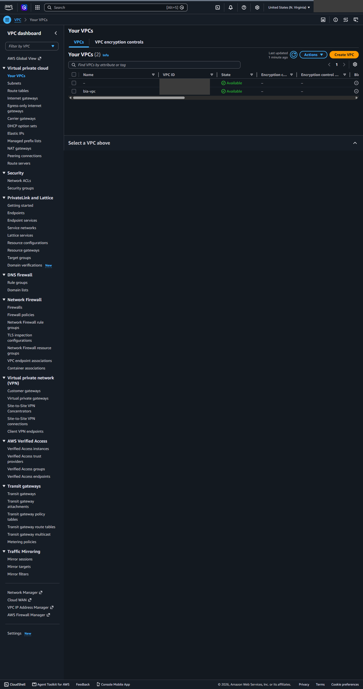

### 2.2 Ler as rotas — 🖥️ CONSOLE (só leitura)
- **Por quê:** é a rota que define "pública" × "privada".
- **Caminho:** VPC › Your VPCs › *Filter by VPC* = `bia-vpc` › aba **Resource map**; depois **Route tables**.

| Tabela | Rotas esperadas | Significado |
|---|---|---|
| `bia-rtb-public` | `0.0.0.0/0 → igw-…` e `10.0.0.0/16 → local` | Tem saída para a internet |
| `bia-rtb-private1-us-east-1a` | só `10.0.0.0/16 → local` | Isolada; `local` é o caminho interno até o RDS |

### 2.3 Ligar IP público automático nas subnets públicas — 🖥️ CONSOLE
- **Por quê:** o assistente cria as subnets com auto-assign **desligado**. Sem NAT, uma EC2 sem IP público não alcança SSM, ECR nem ECS (a EC2 do cluster nunca se registraria).
- **Caminho:** VPC › Subnets › marcar `bia-subnet-public1-us-east-1a` › *Actions* › *Edit subnet settings* › ✔ **Enable auto-assign public IPv4 address** › *Save*. Repita para `bia-subnet-public2-us-east-1b`. **Não** faça nas privadas.
- **Validar (Console):** coluna *Auto-assign public IPv4 address* = `Yes` só nas públicas.
- **Validar (WSL — só funciona depois do passo 4.2; agora dá `UnauthorizedOperation`, o que é esperado):**

```bash
source ~/DESAFIO1/desafio1.sh
VPC_ID=$(aws ec2 describe-vpcs --filters "Name=tag:Name,Values=$BIA_VPC" --query 'Vpcs[0].VpcId' --output text); echo "$VPC_ID"
aws ec2 describe-subnets --filters "Name=vpc-id,Values=$VPC_ID" \
  --query 'sort_by(Subnets,&CidrBlock)[].{Nome:Tags[?Key==`Name`]|[0].Value,Zona:AvailabilityZone,IpPublico:MapPublicIpOnLaunch}' --output table
```

📸 **Evidência** — 4 subnets e a mensagem *Enable auto-assign public IPv4 address*:

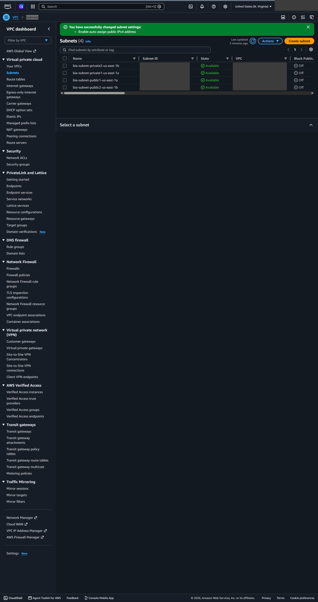

---

## Fase 3 — SGs da máquina de trabalho e key pair

### 3.1 SG `bia-dev` (porta 3001) — 🖥️ CONSOLE
- **Por quê:** a BIA de desenvolvimento roda em Docker na **3001** (`compose.yml: 3001:8080`). Sem porta 22: o acesso diário é por SSM.
- **Caminho:** EC2 › Network & Security › Security Groups › **Create security group**

| Campo | Valor | Por quê |
|---|---|---|
| Name / Description | `bia-dev` / `acesso do bia-dev` (sem acentos) | Nome que os scripts procuram |
| VPC | **`bia-vpc`** | O Console sugere a default, que não serve |
| Inbound | Custom TCP · `3001` · Anywhere-IPv4 · `liberado geral` | Navegador chega na BIA dev |
| Outbound | padrão (All traffic) | Saída para SSM, ECR, GitHub, npm, RDS |

### 3.2 SG `bia-dev-ssh` (porta 22 só do seu IP) — 🖥️ CONSOLE
- **Por quê:** o D2 P1 pede SSH. Em SG separado, a porta 22 sai num clique (5B.4). *My IP* restringe a `<SEU_IP>/32`.
- Mesmo caminho: Name `bia-dev-ssh` · VPC `bia-vpc` · Inbound **SSH** · Source **My IP**. **Não** associe ainda.

### 3.3 Key pair `formacao` — 🖥️ CONSOLE
- **Por quê:** o key pair só pode ser escolhido **no lançamento** da EC2.
- EC2 › Key Pairs › *Create key pair* → Name `formacao` · RSA · `.pem`. O `.pem` é baixado **uma vez**; nunca o coloque no repositório.

📸 **Evidência** — SG `bia-dev` na `bia-vpc` *(print tirado após a F10: também mostra `bia-web` e `bia-db`; o `bia-dev-ssh` não aparece)*:

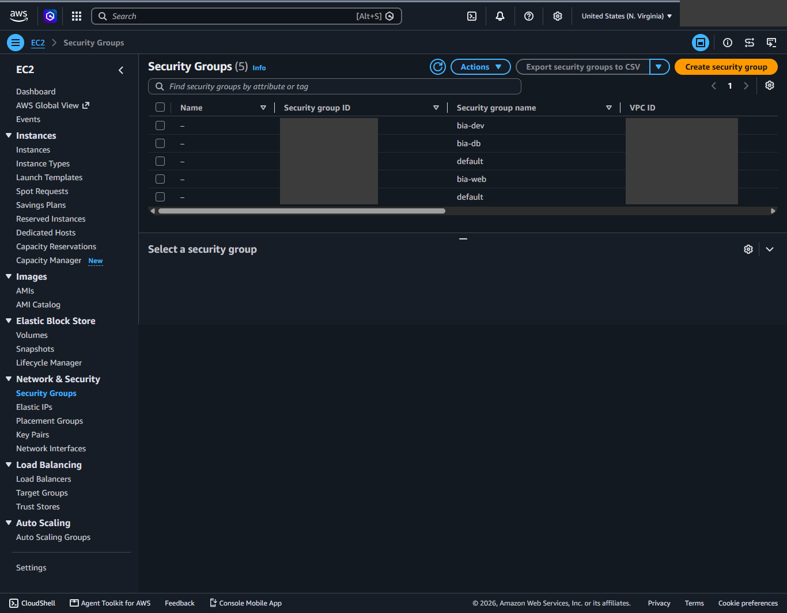

---

## Fase 4 — Role `role-acesso-ssm` e permissões do usuário

> Entrega "**permissões IAM para o usuário ao invés da role**": quem roda o script é o `formacao_aws`, então é ele que precisa poder criar a role.

### 4.1 Rodar o `criar_role_ssm.sh` e ler o erro — 💻 WSL
```bash
cd ~/bia && bash scripts/criar_role_ssm.sh
```
- **O que o script resolve:** cria a role `role-acesso-ssm` (trust para EC2) com `AmazonSSMManagedInstanceCore` e o instance profile de mesmo nome.
- **Resultado agora:** `AccessDenied` em `iam:CreateRole`, `CreateInstanceProfile`, `AddRoleToInstanceProfile`, `AttachRolePolicy`.

### 4.2 Inline `PermissaoScriptsIAM` + `AmazonEC2FullAccess` — 🖥️ CONSOLE
- **Por quê:** a inline libera só as ações de IAM do script — inclusive **`iam:PassRole`**, que o `AmazonEC2FullAccess` **não** inclui (entregar uma role a uma máquina é delegação de privilégio). O EC2FullAccess vem porque o próximo passo lê a VPC e lança instância.
- **Caminho:** IAM › Users › `formacao_aws` › *Add permissions* › **Create inline policy** › JSON:

```json
{
  "Version": "2012-10-17",
  "Statement": [{
    "Effect": "Allow",
    "Action": ["iam:CreateRole","iam:GetRole","iam:CreateInstanceProfile","iam:GetInstanceProfile",
               "iam:AddRoleToInstanceProfile","iam:AttachRolePolicy","iam:PassRole"],
    "Resource": "*"
  }]
}
```
Policy name `PermissaoScriptsIAM` → *Create policy*. Depois *Add permissions* › *Attach policies directly* › `AmazonEC2FullAccess`.

### 4.3 Rodar de novo e conferir — 💻 WSL
```bash
bash scripts/criar_role_ssm.sh
aws iam get-role --role-name role-acesso-ssm --query 'Role.RoleName' --output text
aws iam get-instance-profile --instance-profile-name role-acesso-ssm --query 'InstanceProfile.Roles[0].RoleName' --output text
```
- **Resultado:** `role-acesso-ssm` duas vezes. Repita agora o bloco de validação do 2.3 (tabela de subnets). *Não* use o `validar_recursos_zona_a.sh` — ele procura a VPC default.

📸 **Evidência** — `formacao_aws` com a inline `PermissaoScriptsIAM` e o `AmazonEC2FullAccess` desta fase *(print tirado após a F10: já inclui `AmazonRDSFullAccess` e `AmazonECS_FullAccess`; o `AmazonS3FullAccess` da F19 ainda não aparece)*:

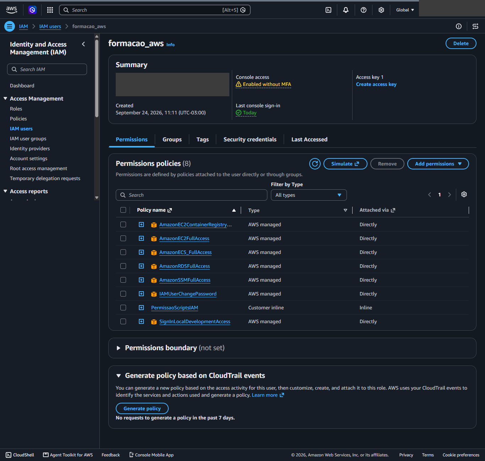

---

## Fase 5 — Lançar a `bia-dev` por script e entrar via SSM

### 5.1 Criar o `lancar-bia-dev.sh` — 💻 WSL
- **Por quê:** o D2 P2 pede lançar por script. O `lancar_ec2_zona_a.sh` do projeto usa a VPC default; esta versão usa a `bia-vpc`, acha subnet/SG pelo nome e não duplica a máquina.

```bash
cat > ~/DESAFIO1/lancar-bia-dev.sh <<'FIM'
#!/usr/bin/env bash
# Lanca a EC2 bia-dev na subnet publica da zona a da bia-vpc.
NOME=bia-dev
SUBNET_NOME=bia-subnet-public1-us-east-1a
USER_DATA=$HOME/bia/scripts/user_data_ec2_zona_a.sh

EXISTENTE=$(aws ec2 describe-instances \
  --filters "Name=tag:Name,Values=$NOME" "Name=instance-state-name,Values=pending,running,stopping,stopped" \
  --query "Reservations[].Instances[].InstanceId[]" --output text)
if [ -n "$EXISTENTE" ]; then echo "bia-dev ja existe: $EXISTENTE"; exit 0; fi

SUBNET_ID=$(aws ec2 describe-subnets --filters "Name=tag:Name,Values=$SUBNET_NOME" --query "Subnets[0].SubnetId" --output text)
VPC_ID=$(aws ec2 describe-subnets --subnet-ids "$SUBNET_ID" --query "Subnets[0].VpcId" --output text)
SG_ID=$(aws ec2 describe-security-groups --filters "Name=group-name,Values=bia-dev" "Name=vpc-id,Values=$VPC_ID" \
  --query "SecurityGroups[0].GroupId" --output text)
AMI_ID=$(aws ssm get-parameter --name /aws/service/ami-amazon-linux-latest/al2023-ami-kernel-default-x86_64 \
  --query Parameter.Value --output text)
for v in SUBNET_ID SG_ID AMI_ID; do
  if [ -z "${!v}" ] || [ "${!v}" = "None" ]; then echo "[ERRO] $v nao encontrado"; exit 1; fi
done
echo "Subnet $SUBNET_ID | SG $SG_ID | AMI $AMI_ID"

aws ec2 run-instances --image-id "$AMI_ID" --count 1 --instance-type t3.micro \
  --network-interfaces "DeviceIndex=0,SubnetId=$SUBNET_ID,Groups=$SG_ID,AssociatePublicIpAddress=true" \
  --block-device-mappings '[{"DeviceName":"/dev/xvda","Ebs":{"VolumeSize":15,"VolumeType":"gp2"}}]' \
  --tag-specifications "ResourceType=instance,Tags=[{Key=Name,Value=$NOME}]" \
  --iam-instance-profile Name=role-acesso-ssm \
  --key-name formacao \
  --user-data "file://$USER_DATA" \
  --query 'Instances[0].InstanceId' --output text
FIM
chmod +x ~/DESAFIO1/lancar-bia-dev.sh
```

| Trecho | Equivalente no Console | O que resolve |
|---|---|---|
| `ssm get-parameter …al2023…` | AMI Amazon Linux 2023 | Sempre a AMI mais recente (o script original fixa um ID que envelhece) |
| `--network-interfaces …AssociatePublicIpAddress=true` | VPC, Subnet, Auto-assign IP, SG | Tudo num parâmetro |
| `--iam-instance-profile role-acesso-ssm` | Advanced › IAM instance profile | Sem ele a máquina nunca aparece no SSM (exige `iam:PassRole`) |
| `--user-data file://…` | Advanced › User data | 1º boot instala Docker, Compose, git, jq, AWS CLI, Node 24, Python, uv e swap |
| `--key-name formacao` | Key pair | Chave pública para o SSH da Fase 5B |
| `15 GiB gp2` | Storage | Espaço para imagens Docker e `node_modules` |

### 5.2 Lançar e esperar o SSM `Online` — 💻 WSL
```bash
~/DESAFIO1/lancar-bia-dev.sh
BIA_DEV_ID=$(aws ec2 describe-instances --filters "Name=tag:Name,Values=$BIA_DEV" "Name=instance-state-name,Values=running" \
  --query 'Reservations[0].Instances[0].InstanceId' --output text)
aws ssm describe-instance-information --filters "Key=InstanceIds,Values=$BIA_DEV_ID" \
  --query 'InstanceInformationList[0].PingStatus' --output text
```
- **Resultado:** `Online` (se vier `None`, espere 2–5 min).

📸 **Evidência** — `bia-dev` t3.micro `Running`, 3/3 checks, IP privado 10.0.2.x:

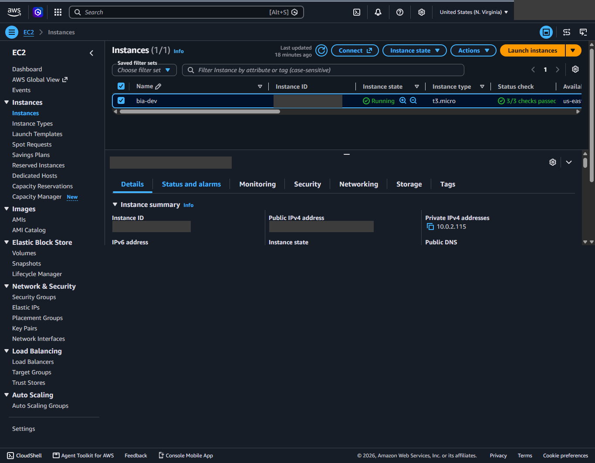

### 5.3 Entrar pelo SSM — 💻 WSL → ☁️ BIA-DEV
```bash
aws ssm start-session --target "$BIA_DEV_ID" --document-name AWS-StartInteractiveCommand --parameters command="bash -l"
sudo su - ec2-user
ps -ef --forest | grep [s]sm          # ssm-session-worker = prova de que a sessão é SSM
docker --version && docker compose version && git --version && node -v
```
- **O que resolve:** `AWS-StartInteractiveCommand` + `bash -l` abre Bash de login (em vez do `sh`); `sudo su - ec2-user` leva ao usuário de trabalho.
- Ferramenta faltando? O user data ainda roda: `sudo tail -n 5 /var/log/cloud-init-output.log`.

---

## Fase 5B — SSH × SSM na `bia-dev`

### 5B.1 Associar `bia-dev-ssh` — 🖥️ CONSOLE
EC2 › Instances › `bia-dev` › *Actions* › *Security* › *Change security groups* → adicionar `bia-dev-ssh` (mantendo `bia-dev`) → *Save*.

### 5B.2 Entrar por SSH — 💻 WSL
```bash
mkdir -p ~/.ssh && chmod 700 ~/.ssh
cp "/mnt/c/Users/<SEU_USUARIO_WINDOWS>/Downloads/formacao.pem" ~/.ssh/formacao.pem
chmod 400 ~/.ssh/formacao.pem          # o SSH recusa chave legível por outros; em /mnt/c o chmod não vale
BIA_DEV_DNS=$(aws ec2 describe-instances --filters "Name=tag:Name,Values=$BIA_DEV" "Name=instance-state-name,Values=running" \
  --query 'Reservations[0].Instances[0].PublicDnsName' --output text)
ssh -i ~/.ssh/formacao.pem ec2-user@"$BIA_DEV_DNS"
echo "$SSH_CLIENT"; whoami; exit       # <SEU_IP> <porta> 22 · ec2-user
```

### 5B.3 Mesma prova pelo SSM — 💻 WSL → ☁️
Abra a sessão SSM (5.3) e rode `echo "SSH_CLIENT=[$SSH_CLIENT]"; whoami; ps -ef --forest | grep [s]sm-session`.

| | SSH (5B.2) | SSM (5B.3) |
|---|---|---|
| `$SSH_CLIENT` | seu IP + porta 22 | **vazio** — nada entrou pela 22 |
| `whoami` | `ec2-user` | `ssm-user` |
| Quem autoriza | o `.pem` | o IAM |

### 5B.4 Retirar `bia-dev-ssh` — 🖥️ CONSOLE + 💻
*Change security groups* → *Remove* `bia-dev-ssh` → *Save*. Validar: `ssh -o ConnectTimeout=10 -i ~/.ssh/formacao.pem ec2-user@"$BIA_DEV_DNS"` → `Connection timed out`. O SSM continua funcionando (não depende de porta de entrada).

**✅ Entrega D2 · P1:** VM conectada (F1) · bia-dev lançada (F5) · SSM (5.3/5B.3) e SSH (5B.2) com a 22 fechada depois (5B.4).

---

## Fase 6 — Fork, clone e BIA na `bia-dev` (3001)

### 6.1 Fork, chave SSH e clone — 🌐 GITHUB + ☁️ BIA-DEV
- **Por quê:** o fork é a sua cópia; é nele que o botão alterado será commitado (e o pipeline futuro dispara pelo push).
- GitHub: `https://github.com/henrylle/bia` › **Fork** › Owner `<SEU_USUARIO_GITHUB>`.

```bash
# ☁️ BIA-DEV (como ec2-user)
ssh-keygen -t rsa -b 4096 -N "" -f ~/.ssh/id_rsa
git config --global user.name "<SEU_NOME>"
git config --global user.email "<SEU_EMAIL_GITHUB>"
cat ~/.ssh/id_rsa.pub       # copie SÓ a pública
```
GitHub › Avatar › *Settings* › *SSH and GPG keys* › *New SSH key* → Title `bia-dev`, Key = saída do `cat`.

```bash
ssh -T git@github.com                                  # Hi <SEU_USUARIO_GITHUB>! You've successfully authenticated…
cd ~ && git clone git@github.com:<SEU_USUARIO_GITHUB>/bia.git && cd bia
git remote get-url origin                              # deve ser o SEU fork
# se clonou o repositório do instrutor: git remote remove origin && git remote add origin git@github.com:<SEU_USUARIO_GITHUB>/bia.git
```

### 6.2 Rodar a BIA na bia-dev — ☁️ BIA-DEV + 🌐
- **Por quê:** o front roda **no navegador**, e o endereço da API é gravado **no build** (`VITE_API_URL`). Por isso vai o IP público da bia-dev, não `localhost`.

```bash
IP_DEV=$(curl -s http://checkip.amazonaws.com); echo "$IP_DEV"
sed -i "s#VITE_API_URL=http://[^ ]*#VITE_API_URL=http://$IP_DEV:3001#" Dockerfile
docker compose up -d --build
docker compose exec server bash -c 'npx sequelize db:migrate'
```
Navegador: `http://<IP_PUBLICO_BIA_DEV>:3001` → salve uma tarefa; `…:3001/api/versao` → `Bia 4.3.0`.

📸 **Evidência** — BIA na bia-dev (porta 3001), tarefa salva, botão original *Add New Task*:

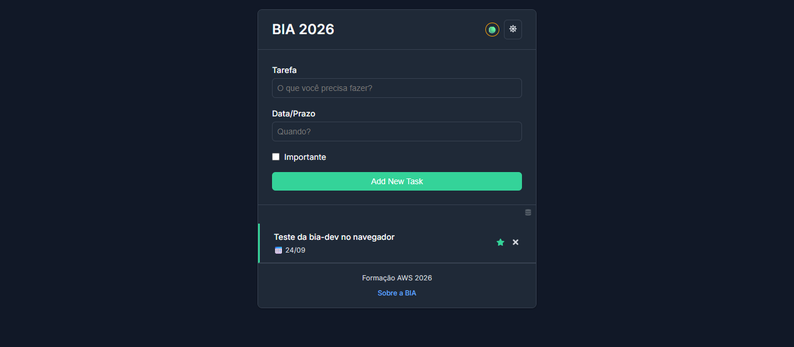

Depois, **parar e desfazer** (libera memória da t3.micro e não versiona o IP):
```bash
docker compose down && git checkout -- Dockerfile
```

---

## Fase 7 — ECR: repositório e teste de comunicação

### 7.1 Criar o repositório `bia` — 🖥️ CONSOLE
- **Por quê:** o ECS **não faz build**; ele puxa a imagem do ECR.
- Amazon ECR › Private registry › Repositories › **Create repository** → Name `bia` → demais padrão → *Create*. URI: `<ACCOUNT_ID>.dkr.ecr.us-east-1.amazonaws.com/bia`.

📸 **Evidência:**

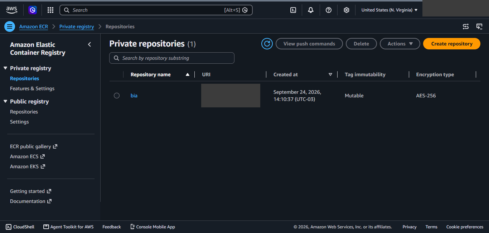

### 7.2 Listar pelo WSL (usuário) — 💻 WSL
`aws ecr describe-repositories --query 'repositories[].repositoryUri' --output text` → a URI. (O `formacao_aws` já tem ECR desde o 1.1.)

### 7.3 Testar pela bia-dev (role) e dar policies à role — ☁️ + 🖥️
- **Por quê:** a EC2 **não usa as credenciais do seu terminal**; só tem o que a role tem.

```bash
aws ecr describe-repositories --region us-east-1    # ☁️ agora: AccessDeniedException
```
🖥️ IAM › Roles › `role-acesso-ssm` › *Add permissions* › *Attach policies*:

| Policy | Para quê |
|---|---|
| `AmazonEC2ContainerRegistryPowerUser` | push/pull no ECR (`build.sh`) |
| `AmazonECS_FullAccess` (com `_`; a aula escreve sem) | `deploy.sh` e leitura do cluster pelo Kiro (inclui leitura de logs) |
| `AmazonEC2FullAccess` | diagnóstico do Kiro (SGs, instâncias) |
| `AmazonRDSFullAccess` | diagnóstico do Kiro (RDS) |

```bash
aws ecr describe-repositories --region us-east-1 --query 'repositories[].repositoryName' --output text   # ☁️ bia
```

---

## Fase 8 — Build e push do WSL para o ECR

### 8.1 Login, build, tag e push — 💻 WSL
```bash
cd ~/bia
ACCOUNT_ID=$(aws sts get-caller-identity --query Account --output text)
REGISTRY=$ACCOUNT_ID.dkr.ecr.us-east-1.amazonaws.com
aws ecr get-login-password --region us-east-1 | docker login --username AWS --password-stdin "$REGISTRY"
docker build -t bia .
docker tag bia:latest "$REGISTRY/bia:latest"
docker push "$REGISTRY/bia:latest"
```

| Trecho | O que resolve |
|---|---|
| `get-login-password \| docker login` | Token do ECR (12 h) entregue ao Docker sem aparecer na tela |
| `docker build -t bia .` | Imagem a partir do `Dockerfile` da raiz |
| `docker tag` | Dá à imagem o endereço do repositório remoto |
| `docker push` | Envia as camadas (as próximas vezes só as alteradas) |

- **Resultado:** `Login Succeeded` · `latest: digest: sha256:…`.

### 8.2 Conferir a imagem — 💻 + 🖥️
```bash
aws ecr describe-images --repository-name bia --query 'imageDetails[].{Tags:imageTags[0],MB:imageSizeInBytes,Push:imagePushedAt}' --output table
```
📸 **Evidência** — tag `latest` no ECR (~215 MB):

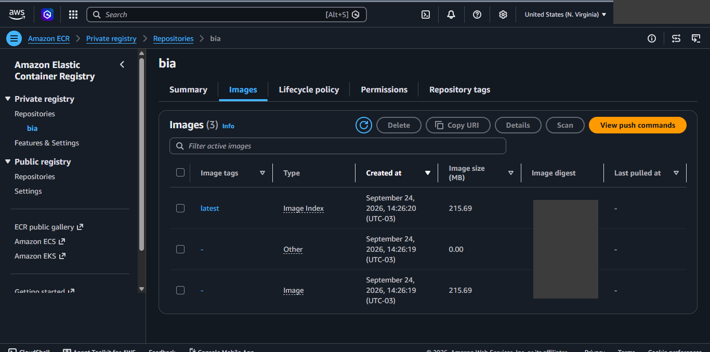

**✅ Entrega D2 · P2:** bia-dev por script + BIA rodando (F5/F6) · permissões no usuário (F1/F4) · ECR testado pelo usuário e pela role (F7) · build e push do WSL (F8).

---

# Preparatório · Desafio 1 — BIA no ECS (porta 80) + diagnóstico do Kiro-CLI

> **Contexto da aula:** subir uma EC2 à mão quando a anterior cai é *reação*, não escalabilidade. O caminho é: imagem versionada no **ECR** → **ECS** (cluster de EC2 via ASG/Launch Template, service que mantém tasks de pé) → **RDS** gerenciado. O agente de IA (Kiro) ajuda em infraestrutura, troubleshooting e diagnóstico.

## Fase 9 — Kiro-CLI com o agente `bia`

### 9.1 Instalar e autenticar — ☁️ BIA-DEV
- **Por quê na bia-dev:** o diagnóstico deve usar a **role da instância** (sem chave no disco). Plano **KIRO FREE** basta.

```bash
curl -fsSL https://cli.kiro.dev/install | bash
kiro-cli --version                     # command not found? exec bash -l
kiro-cli login --use-device-flow       # escolha "Use with Builder ID"; abra a URL no navegador e confirme o código
```
Alternativa (método zip da aula — instale **fora** de `~/bia`):
```bash
cd ~ && curl --proto '=https' --tlsv1.2 -sSf 'https://desktop-release.q.us-east-1.amazonaws.com/latest/kirocli-x86_64-linux.zip' -o kirocli.zip
unzip kirocli.zip && ./kirocli/install.sh && rm -rf ~/kirocli ~/kirocli.zip
```
- **Resultado:** `Device authorized` · `Logged in successfully`.

### 9.2 Conhecer contexto, rules e agente — ☁️ BIA-DEV
```bash
cd ~/bia && cat .kiro/agents/bia.json && ls .kiro/rules/
```

| Arquivo | O que define |
|---|---|
| `.kiro/agents/bia.json` | **Agente** `bia`: prompt de DevOps AWS, `"tools": ["*"]`, recursos `AmazonQ.md`, `README.md` e rules. **Não declara MCP** — usa o AWS CLI pela role |
| `.kiro/rules/infraestrutura.md` | **Rules** (limites): nomes `cluster-bia`/`service-bia`/`task-def-bia`, SGs `bia-*` com descrição "acesso vindo de …", 1 vCPU / 400 MB, rolling update |
| `.kiro/rules/dockerfile.md`, `pipeline.md` | Dockerfile simples single stage; pipeline = CodePipeline + CodeBuild |
| `.kiro/bia-com-mcp-db-aws.json` | Variante **opcional** com MCP servers `postgres` (banco local `localhost:5433`, só com compose de pé) e `aws-mcp` (ferramenta `aws___run_script`, auditável) |

### 9.3 Primeira conversa — 🤖 KIRO
```bash
cd ~/bia && kiro-cli chat --agent "bia"
```
Prompt: `quais regras de infraestrutura voce conhece deste projeto? responda em uma lista curta.`
- **Validar:** a resposta cita `cluster-bia`, `service-bia`, SGs `bia-*`, 400 MB / 1 vCPU. Resposta genérica ou `agent "bia" not found, using "kiro_default"` = você não está em `~/bia`.
- Atalhos: `/quit` (mostra `--resume-id`), `/copy` (copia a última resposta), aprovação *Yes, single permission* × *Trust*.

📸 **Evidência** — Kiro autenticado, agente `bia` ativo em `~/bia (main)`:

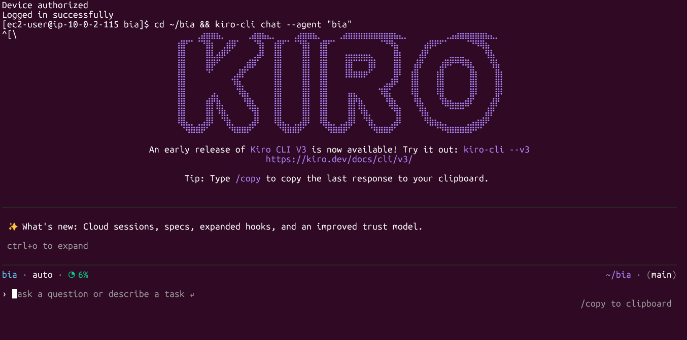

---

## Fase 10 — SGs de produção `bia-web` e `bia-db`

> Toda comunicação de rede na AWS passa por Security Groups.
> ```
> internet --:3001--> [SG bia-dev] EC2 bia-dev (dev; roda migrations)
> internet --:80----> [SG bia-web] EC2 do cluster ECS ("produção")
>                          |                     |
>                          +------:5432----------+--> [SG bia-db] RDS
> ```

### 10.1 Dar RDS e ECS ao terminal — 🖥️ CONSOLE
IAM › Users › `formacao_aws` › *Add permissions* › *Attach policies directly* › `AmazonRDSFullAccess` + `AmazonECS_FullAccess`.
**Por quê:** o WSL passa a consultar RDS/ECS (endpoint, IP do ECS, túnel do D4).
📸 Evidência: `AmazonRDSFullAccess` e `AmazonECS_FullAccess` aparecem no print de policies da [Fase 4](#fase-4--role-role-acesso-ssm-e-permissões-do-usuário).

### 10.2 Criar `bia-web` (80) e depois `bia-db` (5432) — 🖥️ CONSOLE
- **Por quê a ordem:** a regra do `bia-db` **aponta para o SG** `bia-web`, então ele precisa existir antes.
- **Por quê origem = SG (e não IP):** libera "quem veste o SG", independentemente do IP (que muda quando o ASG recria a EC2).
- **Caminho:** EC2 › Security Groups › *Create security group* (duas vezes)

| SG | VPC | Inbound | Descrição da regra |
|---|---|---|---|
| `bia-web` (desc. `acesso do bia-web`) | `bia-vpc` | HTTP 80 · Anywhere-IPv4 | `liberado geral` |
| `bia-db` (desc. `acesso do bia-db`) | `bia-vpc` | PostgreSQL 5432 · Custom → `sg-… \| bia-web` | `acesso vindo de bia-web` |
| | | PostgreSQL 5432 · Custom → `sg-… \| bia-dev` | `acesso vindo de bia-dev` |

Outbound padrão (SG é **stateful**: a resposta volta sozinha).

- **Validar — 💻 WSL:**
```bash
VPC_ID=$(aws ec2 describe-vpcs --filters "Name=tag:Name,Values=bia-vpc" --query 'Vpcs[0].VpcId' --output text)
aws ec2 describe-security-groups --filters "Name=vpc-id,Values=$VPC_ID" "Name=group-name,Values=bia-*" \
  --query 'SecurityGroups[].{SG:GroupName,Porta:IpPermissions[0].FromPort,Ip:IpPermissions[0].IpRanges[0].CidrIp,DeSG:IpPermissions[0].UserIdGroupPairs[].Description}' --output json
```
- **Resultado:** `bia-dev` 3001 `0.0.0.0/0` · `bia-web` 80 `0.0.0.0/0` · `bia-db` 5432 `Ip: null` com `DeSG` = as duas descrições (`null` é o certo: a origem é SG).

📸 Evidência: ver a imagem de SGs na [Fase 3](#fase-3--sgs-da-máquina-de-trabalho-e-key-pair).

---

## Fase 11 — RDS PostgreSQL `bia`

### 11.1 Criar o banco — 🖥️ CONSOLE (~10 min até *Available*; siga para a F12 enquanto isso)
- **Por quê:** a BIA de produção precisa de um PostgreSQL **fora** das EC2 (sobrevive à troca de tasks/instâncias; patch e backup gerenciados).
- **Caminho:** Aurora and RDS › Databases › **Create database**

| Campo | Valor | Por quê |
|---|---|---|
| Creation method | **Full configuration** | Mostra todas as opções |
| Engine | PostgreSQL (versão padrão do Console — ver *Pontos a confirmar*) | Mesmo banco do compose |
| Templates | **Free tier** | Limita a opções gratuitas |
| Availability | Single-AZ (1 instance) | Sem standby (simplicidade/custo) |
| DB instance identifier | `bia` | `$RDS_ID` |
| Master username | `postgres` | Mesmo `DB_USER` |
| Credentials management | **Self managed** + ✔ Auto generate password | Senha aparece no fim (*View connection details*) |
| Instance class | `db.t3.micro` | Rule |
| Allocated storage | `20` · ✘ Enable storage autoscaling | Disco não cresce sozinho |
| Compute resource | Don't connect to an EC2 compute resource | Evita SGs automáticos |
| VPC | **`bia-vpc`** | Não muda depois |
| DB subnet group | Create new | Exige subnets em 2 AZs |
| Public access | **No** | ≠ aula: de fora, só por túnel (D4) |
| VPC security group | Choose existing → **`bia-db`** (remova o `default`) | Só o `bia-db` controla a 5432 |
| Availability Zone | `us-east-1a` | Mesma zona da bia-dev |
| Monitoring / Performance Insights | ✘ | Sem custo extra |
| Initial database name | (vazio) | O database `bia` nasce na F15 com `db:create` |
| Automated backups | ✘ | Ambiente de estudo |

*Create database* → no banner, **View connection details** → copie a **Master password** (`<SENHA_RDS>`) para um gerenciador de senhas. **Nunca** num arquivo do repositório. Perdeu? *Modify › New master password*.

📸 **Evidência** — banco `bia` criado, *Available*, us-east-1a:

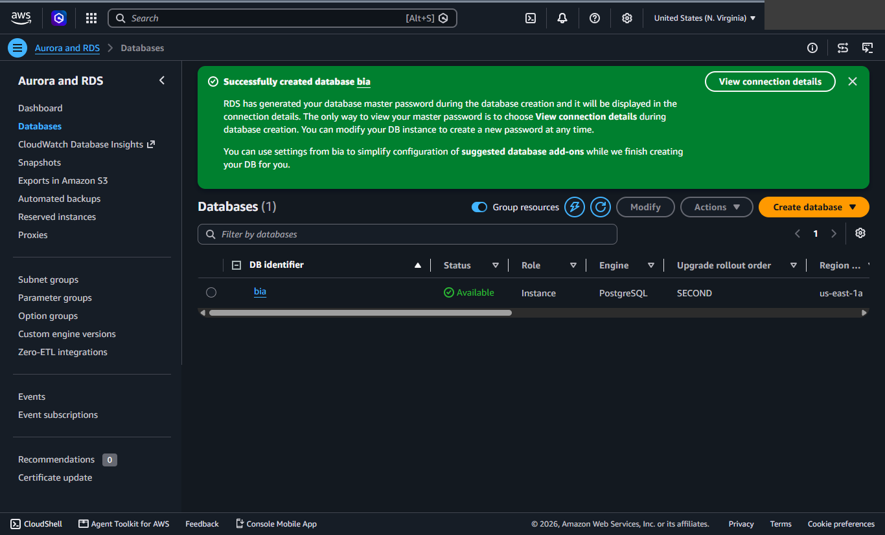

### 11.2 Anotar o endpoint — 💻 WSL
```bash
aws rds describe-db-instances --db-instance-identifier "$RDS_ID" \
  --query 'DBInstances[0].{Status:DBInstanceStatus,Endpoint:Endpoint.Address,Publico:PubliclyAccessible,Zona:AvailabilityZone}' --output table
```
- **Resultado:** `available` · `Publico False` · endpoint `bia.xxxx.us-east-1.rds.amazonaws.com` (`<ENDPOINT_RDS>`).

---

## Fase 12 — Cluster ECS `cluster-bia`

### 12.1 Criar o cluster com EC2 — 🖥️ CONSOLE
- **Por quê:** o cluster é o poder computacional. Por baixo, o Console cria um **stack CloudFormation** com Launch Template (t3.micro, SG, registro no cluster) e **Auto Scaling Group** (faz a instância nascer/morrer).
- **Caminho:** Amazon ECS › Clusters › **Create cluster**

| Campo | Valor | Por quê |
|---|---|---|
| Cluster name | `cluster-bia` | `$CLUSTER` |
| Infrastructure | ✔ **Fargate and Self-managed instances** | Permite EC2 no cluster |
| ASG | Create new ASG · On-demand | Cria e repõe a EC2 |
| OS/Architecture | padrão (Amazon Linux 2023) | AMI com agente ECS |
| EC2 instance type | `t3.micro` | Rule |
| Desired capacity | Min **1** · Max **1** | Uma máquina; a porta 80 dela é da BIA |
| SSH Key pair | None | Sem SSH |
| VPC | **`bia-vpc`** | ≠ aula |
| Subnets | **só as públicas** 1a e 1b (remova as privadas) | Sem NAT, a privada não alcança ECR/ECS |
| Security group | Existing → **`bia-web`** (remova o default) | Abre a 80 |
| Auto-assign public IP | **Turn on** | IP usado no navegador (entrega 1) |
| Container Insights | Turned off | Sem custo extra |
| Logging for ECS Exec | None | Não usado |

- **Resultado:** `Cluster cluster-bia has been created successfully` · EC2 › Instances: `ECS Instance - cluster-bia` *Running*.

📸 **Evidência** — cluster criado com `1 EC2` (ainda sem service):

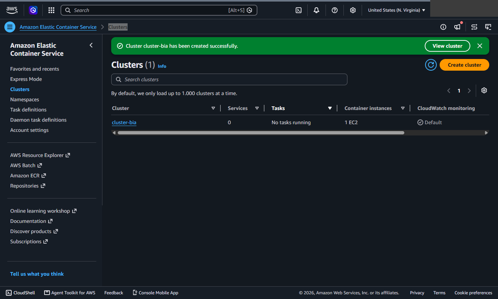

### 12.2 Confirmar o registro da EC2 no cluster — 💻 WSL
```bash
aws ecs describe-clusters --clusters "$CLUSTER" --query 'clusters[0].{Status:status,Instancias:registeredContainerInstancesCount}' --output table
```
- **Resultado:** `ACTIVE` · `Instancias 1`. **0?** Revise IP público (2.3) e subnets públicas — sem registro a task fica em PENDING para sempre.

---

## Fase 13 — Task definition `task-def-bia`

### 13.1 Criar — 🖥️ CONSOLE
- **Por quê:** o service só lança o que a task definition descreve (imagem, CPU/memória, portas, variáveis). Cada alteração vira uma **revisão** (`:1`, `:2`…).
- **Caminho:** Amazon ECS › Task definitions › **Create new task definition**

| Campo | Valor | Por quê |
|---|---|---|
| Family | `task-def-bia` | Rule |
| Launch type | ✘ Fargate · ✔ **Amazon EC2 instances** | Roda no cluster da F12 |
| OS/Architecture | Linux/X86_64 | t3 = x86 |
| Network mode | **bridge** | Padrão Docker, mapeamento de porta host↔container |
| Task size CPU/Memory | (em branco) | Limites vão no container |
| Container › Name | `bia` | |
| Image URI | *Browse ECR images* › `bia` › select by **image tag** › `latest` | O `deploy.sh` reutiliza a tag |
| Port mappings | Host **80** · Container **8080** · name `porta-80` | API escuta na 8080; acesso entra pela 80 |
| CPU | `1` vCPU | Rule (1024 units) |
| Memory hard limit | (vazio) | Sem trava rígida |
| Memory soft limit | `0.4` GB | Rule (~400 MiB) |
| Env `DB_USER` | `postgres` | lidos por `config/database.js` |
| Env `DB_PWD` | `<SENHA_RDS>` | ⚠️ **tem de ser idêntica à do RDS** (causa do erro 500 no diagnóstico abaixo) |
| Env `DB_HOST` | `<ENDPOINT_RDS>` | Endpoint RDS (liga SSL) |
| Env `DB_PORT` | `5432` | |
| Logging | padrão (CloudWatch) | Logs ajudam o Kiro |

- **Resultado:** `task-def-bia:1 successfully created`.

---

## Fase 14 — Service `service-bia`

### 14.1 Criar o service — 🖥️ CONSOLE
- **Por quê:** o service lança a task e a repõe se cair.
- **Caminho:** Task definitions › `task-def-bia` › *Deploy* › **Create service**

| Campo | Valor | Por quê |
|---|---|---|
| Existing cluster | `cluster-bia` | |
| Service name | `service-bia` | Rule (cenário sem ALB) |
| Compute configuration | **Launch type › EC2** | |
| Desired tasks | `1` | |
| AZ rebalancing | ✘ | Rule |
| Deployment strategy | Rolling update | Rule |
| Min running tasks % | **0** | ≠ rule (50%): com 1 task e a porta 80 fixa numa única EC2, a nova espera a antiga liberar a porta — com 50% o deploy trava |
| Max running tasks % | 100 | Nunca 2 tasks ao mesmo tempo |
| Deployment circuit breaker | ✘ | Ver o erro acontecer, sem rollback automático |

- **Validar:** Clusters › `cluster-bia` › *Tasks* → *Refresh* até **Running** (a task PENDING está puxando a imagem do ECR).
- 📸 Evidência: o print da [Fase 16](#fase-16--ip-do-ecs-botão-novo-e-deploysh) mostra este service com 1 task running, `task-def-bia:1`, rolling update 0%/100% e circuit breaker desligado.

### 14.2 Descobrir o IP do ECS e testar a API — 💻 WSL
```bash
CI_ARN=$(aws ecs list-container-instances --cluster "$CLUSTER" --query 'containerInstanceArns[0]' --output text)
ECS_EC2=$(aws ecs describe-container-instances --cluster "$CLUSTER" --container-instances "$CI_ARN" --query 'containerInstances[0].ec2InstanceId' --output text)
IP_ECS=$(aws ec2 describe-instances --instance-ids "$ECS_EC2" --query 'Reservations[0].Instances[0].PublicIpAddress' --output text); echo "$IP_ECS"
curl -s "http://$IP_ECS/api/versao"; echo
```
- **O que resolve:** sem ALB, o endereço da aplicação é o IP público da EC2 do cluster (container instance → EC2 → IP).
- **Resultado:** `<IP_PUBLICO_ECS>` · `Bia 4.3.0`. A tela ainda não salva tarefas (faltam a tabela — F15 — e o endereço da API — F16).

---

## Fase 15 — Migrations no RDS a partir da `bia-dev`

> Criar o RDS **não** cria tabelas. As migrations rodam da bia-dev, que o `bia-db` aceita na 5432 (regra `acesso vindo de bia-dev`).

### 15.1 Apontar o compose para o RDS e migrar — ☁️ BIA-DEV
- **Por quê:** o container `server` já tem Sequelize e `config/database.js`; basta trocar o destino.
- `nano compose.yml` (bloco `environment` do serviço `server`; `Ctrl+O`, Enter, `Ctrl+X`):

| Antes | Depois |
|---|---|
| `DB_PWD: postgres` (dev) | `DB_PWD: "<SENHA_RDS>"` (entre aspas: caractere especial quebra o YAML) |
| `DB_HOST: database` | `DB_HOST: <ENDPOINT_RDS>` |

```bash
docker compose up -d
docker compose exec server bash -c 'npx sequelize db:migrate'   # 1ª vez: ERROR: database "bia" does not exist
docker compose exec server bash -c 'npx sequelize db:create'    # Database bia created.
docker compose exec server bash -c 'npx sequelize db:migrate'   # criar-tarefas: migrated
```
- **Leitura do erro:** `database "bia" does not exist` prova que **rede e autenticação funcionaram** (senão seria timeout ou falha de senha). **Timeout?** Falta a regra `bia-dev` no `bia-db` (10.2). Opcional: peça ao agente — *"configurei o meu compose.yml para apontar para o rds para que eu consiga rodar as migrates, mas nao estou conseguindo executar. consegue me ajudar a investigar na aws o que esta acontecendo?"* (na aula, o Kiro achou o SG `bia-dev` ausente no `bia-db`).

Consultar endpoint e senha pelo 💻 WSL, se precisar:
```bash
aws rds describe-db-instances --db-instance-identifier "$RDS_ID" --query 'DBInstances[0].Endpoint.Address' --output text
aws ecs describe-task-definition --task-definition task-def-bia --query "taskDefinition.containerDefinitions[0].environment[?name=='DB_PWD'].value" --output text
```

### 15.2 Derrubar e desfazer a senha — ☁️ BIA-DEV
```bash
docker compose down && git checkout -- compose.yml && git status --short
```
**Por quê:** o `.dockerignore` não exclui o `compose.yml`; com a senha nele, o próximo build a levaria para a imagem no ECR ou para um commit.

---

## Fase 16 — IP do ECS, botão novo e `deploy.sh`

### 16.1 Apontar o front para o ECS e alterar o botão — ☁️ BIA-DEV
- **Por quê:** o front ainda chama bia-dev/localhost; agora chama o ECS. O texto novo do botão prova, na entrega 1, que a **imagem nova** chegou.

```bash
read -p "Só o IP do ECS, sem http://: " IP_ECS; read -p "Texto do botão (sem # e sem &): " TEXTO_BOTAO
IP_ECS=${IP_ECS#http://}; IP_ECS=${IP_ECS%%/*}; echo "IP: $IP_ECS | Botão: $TEXTO_BOTAO"
sed -i "s#VITE_API_URL=http://[^ ]*#VITE_API_URL=http://$IP_ECS#" Dockerfile
sed -i '/type="submit"/{n;s#^\( *\).*#\1'"$TEXTO_BOTAO"'#}' client/src/components/AddTask.jsx
grep VITE_API_URL Dockerfile
grep -n -A2 'type="submit"' client/src/components/AddTask.jsx
git add Dockerfile client/src/components/AddTask.jsx
git commit -m "ajuste no botao add task e api apontando para o ecs"
git push origin main
```

| Trecho | O que resolve |
|---|---|
| `${IP_ECS#http://}` / `${IP_ECS%%/*}` | Remove `http://` e `/` digitados por engano |
| 1º `sed` | Troca a URL da API gravada no build (`RUN cd client && VITE_API_URL=… npm run build`) |
| 2º `sed` | Troca a linha seguinte ao `<button type="submit">` pelo seu texto |

- **Resultado:** `RUN cd client && VITE_API_URL=http://<IP_PUBLICO_ECS> npm run build` e o botão com `<TEXTO_DO_SEU_BOTAO>`. Texto com `< >` quebra o JSX.

### 16.2 Preparar e rodar o `deploy.sh` — ☁️ BIA-DEV
- **Por quê:** o `deploy.sh` roda o `build.sh` (login + build + tag + push para o ECR) e força um novo deploy do service. Como a tag continua `latest`, **só** o force-new-deployment faz a task buscar a imagem de novo.

```bash
export AWS_PAGER=""
ACCOUNT_ID=$(aws sts get-caller-identity --query Account --output text)
cp scripts/ecs/unix/build.sh .  && sed -i "s#SEU_REGISTRY#$ACCOUNT_ID.dkr.ecr.us-east-1.amazonaws.com#" build.sh && chmod +x build.sh
cp scripts/ecs/unix/deploy.sh . && sed -i 's#\[SEU_CLUSTER\]#cluster-bia#; s#\[SEU_SERVICE\]#service-bia#' deploy.sh && chmod +x deploy.sh
cat deploy.sh     # ./build.sh + aws ecs update-service --cluster cluster-bia --service service-bia --force-new-deployment
grep VITE_API_URL Dockerfile
./deploy.sh
aws ecs wait services-stable --cluster cluster-bia --services service-bia --region us-east-1 && echo ESTAVEL
aws ecs describe-services --cluster cluster-bia --services service-bia --region us-east-1 \
  --query 'services[0].{Status:status,Desejado:desiredCount,Rodando:runningCount,Deployments:length(deployments)}' --output table
```
- **Resultado:** push termina com `latest: digest: sha256:…`; `ESTAVEL`; `1 · 1 · 1 · ACTIVE`.
- ⚠️ O `deploy.sh` **não para** se o build falhar (`failed to solve`, `No such image`): nenhuma imagem nova vai ao ECR e o ECS só reinicia a antiga. Tudo `CACHED` com digest igual = a imagem não mudou.
- `build.sh`/`deploy.sh` copiados ficam **não rastreados** — não os commite (contêm o Account ID).

📸 **Evidência** — service-bia: 1 running, deployment *Success*, Rolling update **0% min / 100% max**, circuit breaker off:

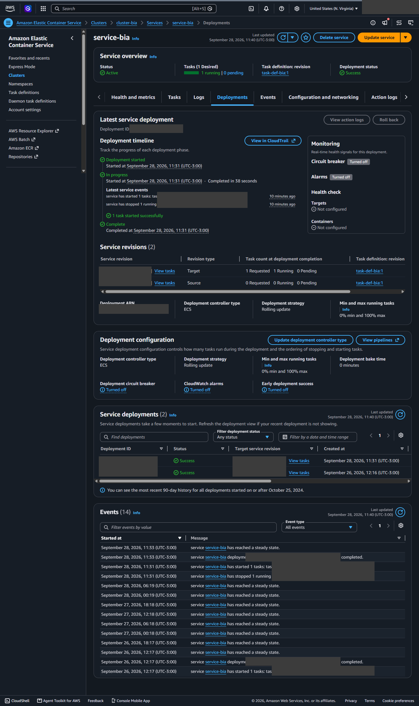

---

## Fase 17 — Entrega 1: print da BIA na porta 80

### 17.1 Cadastrar o e-mail e tirar o print — 🌐 NAVEGADOR + 💻 WSL
- **Por quê:** a tarefa gravada pela tela e lida do banco prova que imagem, ECS, RDS e rede estão ligados.
- IP atual do ECS: bloco do 14.2 (ou EC2 › Instances › `ECS Instance - cluster-bia` › Public IPv4). Deve ser **igual** ao do `Dockerfile` (`grep VITE_API_URL ~/bia/Dockerfile` na bia-dev); se o ASG recriou a EC2, refaça a F16.
- Navegador: `http://<IP_PUBLICO_ECS>` (sem porta = 80) → Tarefa `<SEU_EMAIL>` → data → botão com o texto novo.

**Checklist do print (tudo visível numa única captura):**
- [ ] Barra de endereço com `http://<IP_PUBLICO_ECS>` (sem `:3001`)
- [ ] A tarefa com `<SEU_EMAIL>` **na lista** (depois de clicar no botão)
- [ ] O botão com o texto alterado

- **Validar:** `curl -s "http://$IP_ECS/api/tarefas"; echo` → `…"titulo":"<SEU_EMAIL>"…`

📸 **Evidência da Entrega 1** — BIA servida pelo ECS na porta 80, com o e-mail cadastrado no campo *Tarefa* e o botão alterado para **Salvar tarefa** (o original é *Add New Task*, ver [F6](#fase-6--fork-clone-e-bia-na-bia-dev-3001)):

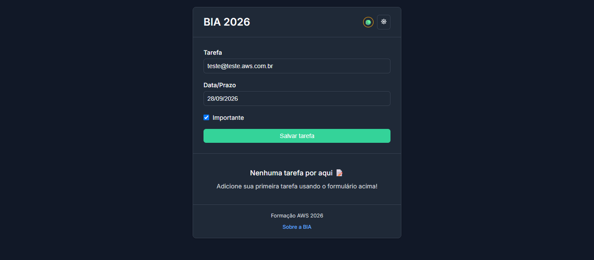

| O que o print comprova | Onde aparece |
|---|---|
| Imagem nova no ECS (deploy da F16 chegou) | Botão **Salvar tarefa** |
| E-mail cadastrado no formulário | Campo *Tarefa* com o e-mail de teste |
| Aplicação no ar | Tela da BIA 2026 carregada |

> Observação: o print foi feito com o e-mail preenchido, antes de a tarefa aparecer na lista, e sem a barra de endereço. Para um print de reforço, capture também a URL `http://<IP_PUBLICO_ECS>` e a tarefa listada após clicar no botão.

<details>
<summary>Se a tarefa não salvar: <code>password authentication failed for user "postgres"</code> (senha da task-def ≠ senha do RDS)</summary>

1. 💻 Ver a revisão e as variáveis em uso:
   ```bash
   TD=$(aws ecs describe-services --cluster cluster-bia --services service-bia --query 'services[0].taskDefinition' --output text); echo "$TD"
   aws ecs describe-task-definition --task-definition "$TD" --query 'taskDefinition.containerDefinitions[0].environment' --output table
   ```
2. ☁️ Testar a senha direto no RDS (não aparece ao digitar):
   ```bash
   read -p "Endpoint do RDS: " RDS_HOST; read -s -p "Senha do RDS: " PGPWD; echo
   docker run --rm -e PGPASSWORD="$PGPWD" postgres:17.1 psql "host=$RDS_HOST user=postgres dbname=bia sslmode=require" -c 'select 1'
   ```
   Nenhuma funciona? 🖥️ RDS › `bia` › *Modify* › *New master password* (só letras e números) › *Apply immediately* → aguarde *Available*.
3. 🖥️ ECS › Task definitions › `task-def-bia` › última revisão › **Create new revision** → corrija `DB_PWD`.
4. 🖥️ Clusters › `cluster-bia` › Services › `service-bia` › **Update service** → revisão nova + ✔ **Force new deployment** → aguarde estável. (O `deploy.sh` **não** troca de revisão, só reinicia a mesma.)
5. Botão ainda *Add New Task*? `Ctrl+F5`; se o texto não estiver no `AddTask.jsx`, refaça 16.1/16.2. Tarefa some ao recarregar? F12 › Network: o POST deve ir para `http://<IP_PUBLICO_ECS>/api/tarefas`.

</details>

---

## Fase 18 — Entrega 2: diagnóstico do Kiro-CLI

### 18.1 Pedir o diagnóstico — ☁️ BIA-DEV → 🤖 KIRO
- **Por quê:** o agente consulta a AWS **com a role da bia-dev**, lê logs, testa a API e monta um relatório.

```bash
cd ~/bia && kiro-cli chat --agent "bia"
```
Prompt da aula:
```
gere um diagnostico pra mim confirmando que minha aplicacao esta rodando corretamente no ecs e se
comunicando com o rds para a entrega do meu desafio da imersao aws com ia
```
Aprove as ferramentas pedidas (o nome varia: `use_aws`, `execute_bash`; `aws___run_script` só na variante com MCP). Salve com `/copy` ou print do relatório inteiro.

**Relatório esperado (checklist):**
- [ ] ECS: `cluster-bia` e `service-bia` ACTIVE · Desired 1 / Running 1 / Pending 0 · ECS Agent conectado
- [ ] Container: `task-def-bia:N` · 8080 → 80 · bridge · EC2 t3.micro running · SG `bia-web`
- [ ] RDS: `bia` available · db.t3.micro · endpoint :5432
- [ ] Logs: `Servidor rodando na porta 8080`, sem erros de query
- [ ] API ao vivo: `GET /api/versao → "Bia 4.3.0"` **e** `GET /api/tarefas → 200` com o seu e-mail
- [ ] Veredicto: aplicação operacional no ECS (cenário 1, sem ALB) **e se comunicando com o RDS**

📸 **Evidência da Entrega 2** — relatório do Kiro-CLI (agente `bia`) sobre o projeto no ECS e a comunicação com o RDS (IDs, IP, endpoint e URI mascarados):

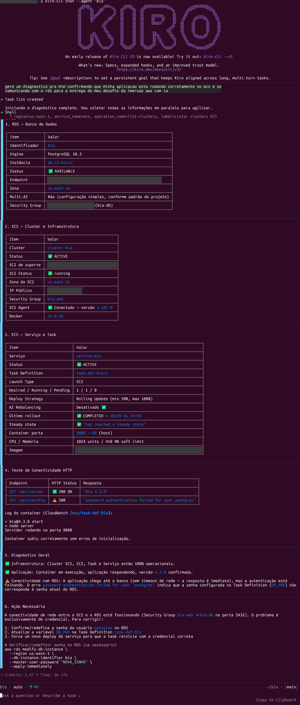

| Bloco do relatório | O que o Kiro confirmou |
|---|---|
| 1. RDS | `bia` **AVAILABLE** · PostgreSQL 18.3 · db.t3.micro · us-east-1a · Single-AZ · SG `bia-db` |
| 2. ECS — cluster | `cluster-bia` **ACTIVE** · EC2 t3.micro **running** (us-east-1b) · SG `bia-web` · ECS Agent conectado (1.107.0) · Docker 25.0.16 |
| 3. ECS — serviço e task | `service-bia` **ACTIVE** · `task-def-bia:1` · EC2 · 1/1/0 · AZ rebalancing desativado · rollout **COMPLETED** · *steady state* · 8080 → 80 · 1024 units / 410 MB soft limit · imagem `bia:latest` do ECR |
| 4. Conectividade HTTP | `GET /api/versao` → **200 "Bia 4.3.0"** · log do container: `Servidor rodando na porta 8080` |
| 5–6. Diagnóstico e ação | Infraestrutura e aplicação 100% operacionais; rede ECS → RDS (`bia-web → bia-db :5432`) funcionando; para `GET /api/tarefas` o Kiro apontou divergência de credencial (`DB_PWD`) e indicou a correção |

> Observações: (1) o bloco 6 do relatório é o mesmo procedimento do item *"Se a tarefa não salvar"* da [F17](#fase-17--entrega-1-print-da-bia-na-porta-80); (2) o relatório descreve o rolling update como "min 50%", enquanto o Console mostra **0% min / 100% max** ([F16](#fase-16--ip-do-ecs-botão-novo-e-deploysh)).

---

# Fundamentais · Desafio 3 — front no S3, API no ECS

## Fases 19–21 — Desafio 3: front no S3

> O React vira arquivo estático no S3 (sem servidor); a API continua no ECS gravando no RDS. **O endereço da API é decisão de build**: fica gravado no JavaScript, por isso vem por argumento — e mudar o IP exige novo build + sync.

### 19.1 Permissão de S3 ao usuário — 🖥️ CONSOLE
IAM › Users › `formacao_aws` › *Add permissions* › `AmazonS3FullAccess`. (Sem ela, o sync volta `Access Denied`.)

### 19.2 Bucket, website hosting e policy de leitura — 💻 + 🖥️
```bash
source ~/DESAFIO1/desafio1.sh; echo "$BUCKET_NAME"      # bia-assets-<ACCOUNT_ID>
```
🖥️ Amazon S3 › Buckets › **Create bucket**:

| Tela | Campo | Valor | Por quê |
|---|---|---|---|
| Create bucket | Bucket type / name / Region | General purpose · o nome do `echo` · us-east-1 | Nome único global |
| | Block all public access | **Desmarcar** + confirmar | Senão a policy pública é recusada |
| Properties › Static website hosting | Enable · Host a static website | Index `index.html` · Error `index.html` | Rotas do React não dão 404 |
| Permissions › Bucket policy | colar a saída abaixo | Todos **só leem** (`GetObject`) — ninguém lista/grava/apaga |

```bash
source ~/DESAFIO1/desafio1.sh; cat <<EOF
{ "Version": "2012-10-17",
  "Statement": [{ "Sid": "PublicReadGetObject", "Effect": "Allow", "Principal": "*",
                  "Action": ["s3:GetObject"], "Resource": ["arn:aws:s3:::$BUCKET_NAME/*"] }] }
EOF
```
- **Validar:** `aws s3api get-bucket-website --bucket "$BUCKET_NAME" --query 'IndexDocument.Suffix' --output text` → `index.html`; `aws s3api get-bucket-policy-status --bucket "$BUCKET_NAME" --query 'PolicyStatus.IsPublic' --output text` → `True`.

📸 **Evidência:**

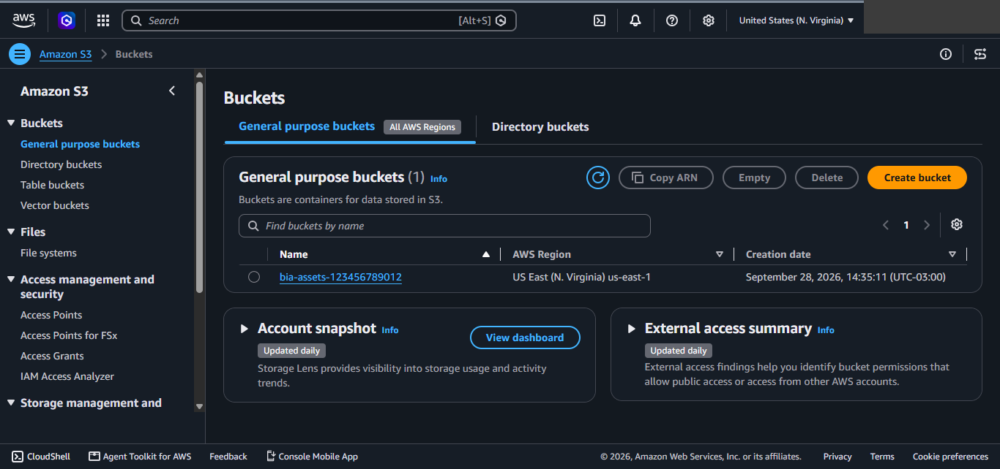

### 20.1 Scripts `react.sh`, `s3.sh`, `deploy.sh` — 💻 WSL
- **Por quê:** uma função por arquivo e um orquestrador que valida o ambiente. Use **`VITE_API_URL`** (o Dockerfile usa Vite), **não** o `REACT_APP_API_URL` da aula — com ele o build passa, o site sobe e aponta para localhost (erro silencioso).

```bash
mkdir -p ~/DESAFIO1/desafio3 && cd ~/DESAFIO1/desafio3
cat > react.sh <<'FIM'
#!/usr/bin/env bash
# Gera os assets estaticos do React da BIA.  Uso interno: build <URL_DA_API>
function build() {
  local API_URL="$1"
  echo "Fazendo build do react... (API: $API_URL)"
  cd "$BIA_DIR" || return 1
  npm install --loglevel=error
  npm install --prefix client --legacy-peer-deps --loglevel=error
  VITE_API_URL="$API_URL" npm run build --prefix client
  cd - > /dev/null
}
FIM
cat > s3.sh <<'FIM'
#!/usr/bin/env bash
# Envia os assets para o bucket.  Uso interno: envio_s3 <NOME_DO_BUCKET>
function envio_s3() {
  aws s3 sync "$BIA_DIR/client/build/" "s3://$1/" --delete --profile formacao_aws
}
FIM
cat > deploy.sh <<'FIM'
#!/usr/bin/env bash
# Deploy do front-end da BIA para o S3.  Uso: ./deploy.sh <hom|prd> <URL_DA_API>
set -e
AMBIENTE="$1"; API_URL="$2"
BUCKET_NAME="${BUCKET_NAME:?defina BUCKET_NAME (source ~/DESAFIO1/desafio1.sh)}"
BIA_DIR="${BIA_DIR:-$HOME/bia}"
if [ "$AMBIENTE" != "hom" ] && [ "$AMBIENTE" != "prd" ]; then
  echo "Ambiente invalido"; echo "Uso: ./deploy.sh <hom|prd> <URL_DA_API>"; exit 1
fi
if [ -z "$API_URL" ]; then echo "Erro: informe a URL da API. Exemplo: ./deploy.sh $AMBIENTE http://x.x.x.x"; exit 1; fi
if [ ! -d "$BIA_DIR/client" ]; then echo "Erro: projeto da BIA nao encontrado em $BIA_DIR"; exit 1; fi
cd "$(dirname "$0")"; export BIA_DIR
. ./react.sh
. ./s3.sh
echo "Vou iniciar deploy no ambiente: $AMBIENTE"; echo "O endereco da API sera: $API_URL"
build "$API_URL"
envio_s3 "$BUCKET_NAME"
echo "Finalizado. Site: http://$BUCKET_NAME.s3-website-us-east-1.amazonaws.com"
FIM
chmod +x deploy.sh react.sh s3.sh
```

| Trecho | O que resolve |
|---|---|
| `. ./react.sh`, `. ./s3.sh` | Carregam as funções (o mesmo que `source`) |
| `if … != hom && … != prd` | Só aceita os dois ambientes |
| `VITE_API_URL=… npm run build --prefix client` | Grava a URL da API no bundle (`client/build`) |
| `aws s3 sync … --delete` | Bucket vira **espelho** do build (apaga o que não existe mais) |
| `${BUCKET_NAME:?…}` / `set -e` | Aborta sem variáveis; se o build falhar, o sync não roda |

### 20.2 Testar as validações — 💻 WSL
```bash
./deploy.sh; echo "saida: $?"
./deploy.sh dev http://1.2.3.4; echo "saida: $?"
./deploy.sh hom; echo "saida: $?"
```
Resultado: `Ambiente invalido` · `Ambiente invalido` · `Erro: informe a URL da API` — todas com `saida: 1`, nada vai ao S3.

### 21.1 Deploy com a URL da API — 💻 WSL
```bash
source ~/DESAFIO1/desafio1.sh
# (reaproveite o bloco do 14.2 para obter $IP_ECS)
curl -s "http://$IP_ECS/api/versao"; echo          # a API tem de responder antes
cd ~/DESAFIO1/desafio3 && ./deploy.sh hom "http://$IP_ECS"
```

### 21.2 Conferir URL no bundle e site no ar — 💻 WSL
```bash
grep -rho "$IP_ECS" ~/bia/client/build/assets | head -1
aws s3 ls "s3://$BUCKET_NAME" --recursive --human-readable
curl -s -o /dev/null -w "%{http_code}\n" "http://$BUCKET_NAME.s3-website-us-east-1.amazonaws.com"   # 200
```
403? Use o endpoint **s3-website** (não o de API) e revise policy/bloqueio público.

📸 **Evidência** — objetos do build no bucket:

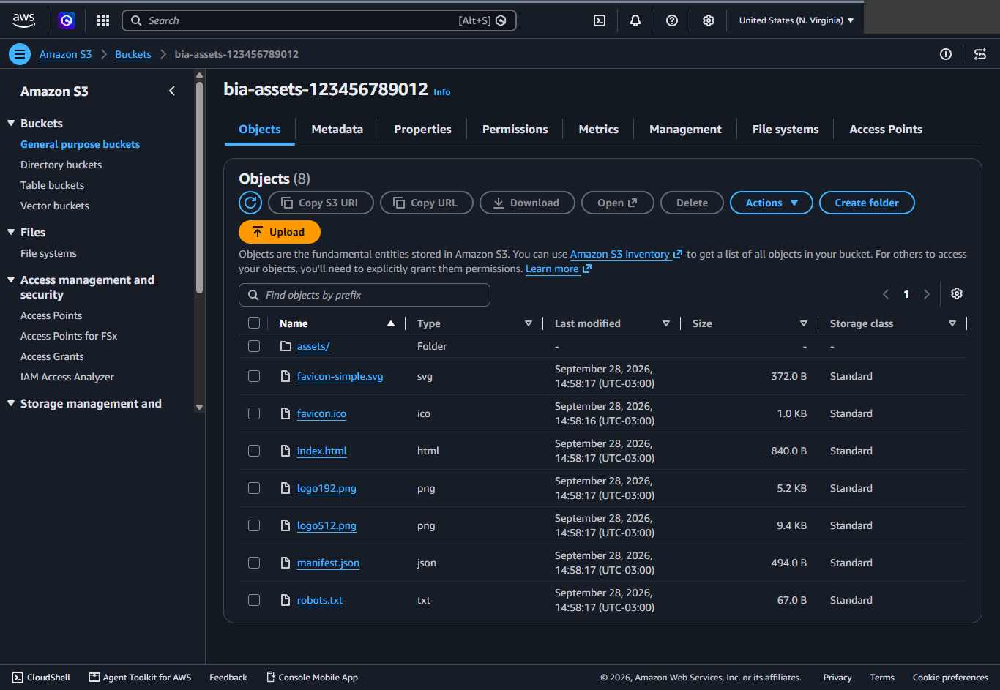

### 21.3 Salvar um registro pelo site — 🌐 + 💻
Navegador: `http://<NOME_UNICO_DO_BUCKET>.s3-website-us-east-1.amazonaws.com` → tarefa `Desafio 3 - salvo pelo site do S3` → botão.
**Por quê funciona:** site (S3) e API (ECS) estão em endereços diferentes, e o `cors()` da BIA permite a chamada. O registro vai para o **RDS**, não para o bucket.
```bash
curl -s "http://$IP_ECS/api/tarefas" | grep -o '"titulo":"[^"]*"'
```

📸 **Evidência** — registro salvo pelo site do S3:

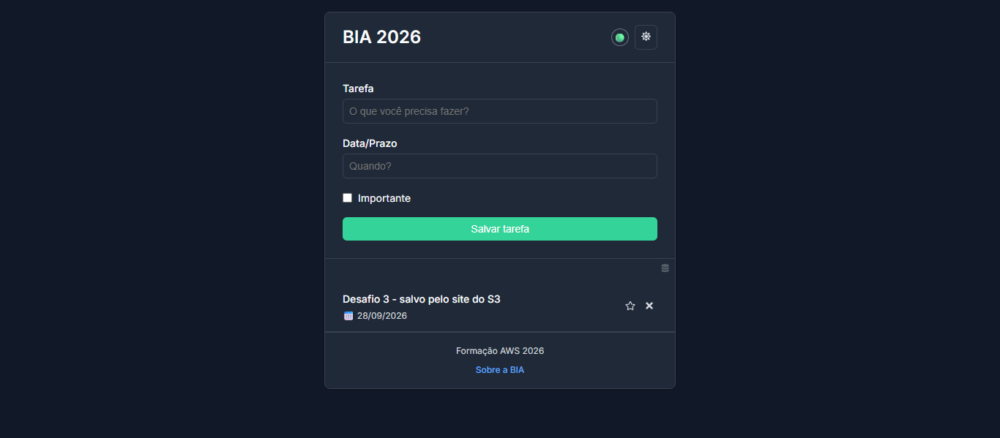

**✅ Entrega D3:** bucket + script com URL por argumento (F19/F20) · sync + API do ECS servindo o site (21.1/21.2) · registro salvo (21.3).

---

# Fundamentais · Desafio 4 — porteiro (bastion) e túneis SSM

## Fases 22–24 — Desafio 4: porteiro e túneis SSM

> O RDS é privado (sem IP público). O **porteiro** é uma EC2 sem porta de entrada, usada só como ponte de túneis SSM: `localhost:5433 → RDS:5432` e `localhost:3002 → EC2 do cluster:80`.

> Os scripts das quatro entregas estão em [`Desafios/`](Desafios/): `01-lancar-porteiro-zona-b.sh`, `02-iniciar-porteiro-tunel-rds.sh`, `03-tunel-bia.sh`, `04-parar-porteiro.sh`. Eles não trazem `--profile` fixo: o profile vem do ambiente (`AWS_PROFILE` do `desafio1.sh`). Os demais arquivos da pasta são material de aula (ver [Anexo G](#anexo-g--material-de-apoio-da-pasta-desafios)).

### 22.1 Trazer os scripts para o Linux e ajustar o 01 — 💻 WSL (não na bia-dev)
- **Por quê copiar:** os scripts ficam no disco do Windows (OneDrive). Copiados para o Linux, rodam com permissão de execução e sem risco de CRLF.
- **Por quê ajustar o 01:** ele procura a **subnet default** da zona (`default-for-az=true`), que só existe na VPC default. Aqui o equivalente é a subnet pública 1b da `bia-vpc`.

```bash
grep -qi microsoft /proc/version && echo "OK: WSL" || echo "PARE: isto não é o WSL (digite exit)"
F=$(find /mnt/c/Users -maxdepth 12 \( -name AppData -o -name node_modules -o -name .git \) -prune -o \
    -type f -name 03-tunel-bia.sh -path '*/Desafios/*' -print -quit 2>/dev/null); DESAFIOS=${F%/*}
echo "Pasta Desafios: ${DESAFIOS:-NAO ENCONTRADA}"
mkdir -p ~/DESAFIO1/desafio4 && cd ~/DESAFIO1/desafio4
cp "$DESAFIOS"/0[1-4]-*porteiro*.sh "$DESAFIOS"/03-tunel-bia.sh .
sed -i 's/\r$//' *.sh && chmod +x *.sh && ls
sed -i 's#"Name=default-for-az,Values=true" "Name=availability-zone,Values=$ZONA"#"Name=tag:Name,Values=bia-subnet-public2-$ZONA"#' 01-lancar-porteiro-zona-b.sh
grep -n 'Name=tag:Name,Values=bia-subnet' 01-lancar-porteiro-zona-b.sh
```
- **Resultado:** os quatro scripts listados e a linha `--filters "Name=tag:Name,Values=bia-subnet-public2-$ZONA" \`. `NAO ENCONTRADA`? Você está na bia-dev (prompt `ec2-user@`), onde `/mnt/c` não existe.

**O que cada script resolve**

| Script | Passo a passo interno | Decisões que importam |
|---|---|---|
| `01-lancar-porteiro-zona-b.sh <nome> [zona=us-east-1b] [tipo=t3.micro]` | 1) já existe instância com o nome (pending/running/stopping/stopped)? sai com "nada a fazer" · 2) acha a subnet da zona · 3) AMI AL2023 via `ssm get-parameters` · 4) acha ou **cria** o SG `bia-porteiro` **sem regra de entrada** · 5) `run-instances` com `role-acesso-ssm` e espera `instance-running` | **Idempotente** (rodar de novo não duplica). `--metadata-options HttpTokens=required` = **IMDSv2** obrigatório. Sem porta aberta: só SSM entra |
| `02-iniciar-porteiro-tunel-rds.sh <nome> <id-rds> [porta=5433]` | acha o porteiro **em qualquer estado** → liga se parado (`start-instances` + `wait instance-running`) → espera o SSM `Online` (30 × 10 s = até 5 min) → lê o endpoint do RDS → abre o túnel | Documento `AWS-StartPortForwardingSessionToRemoteHost`: o porteiro repassa `localhost:5433` para `<endpoint>:5432`. O terminal fica preso no túnel (`Ctrl+C` encerra) |
| `03-tunel-bia.sh <nome> <host-bia> [remota=80] [local=3002]` | recusa host de exemplo (`x.x`/`None`) → exige porteiro **running** (quem liga é o 02) → abre o túnel | Mesmo documento `…ToRemoteHost`, agora para o **IP privado** da EC2 do cluster na porta 80 |
| `04-parar-porteiro.sh <nome>` | acha em qualquer estado → se não estiver `running`, sai com "nada a fazer" (exit 0) → `stop-instances` + `wait instance-stopped` | Parar máquina já parada **não é erro** (idempotente) |

> **Diferença para os scripts da aula** (`05-*`, `06-*`): aqueles usam `AWS-StartPortForwardingSession` (só alcança a **própria** EC2, porta 3001 da bia-dev), `--profile desafios-fundamentais` fixo, `sleep 30` no lugar de esperar o SSM e não tratam porteiro inexistente. Os `01–04` corrigem isso.

### 22.2 Lançar o porteiro — 💻 WSL
`source ~/DESAFIO1/desafio1.sh && ./01-lancar-porteiro-zona-b.sh "$PORTEIRO"` → `Pronto: porteiro-bia esta running na zona us-east-1b`.

### 22.3 Abrir a 5432 do banco para o porteiro — 🖥️ CONSOLE
EC2 › Security Groups › `bia-db` › *Edit inbound rules* › *Add rule* → PostgreSQL · Custom `bia-porteiro` · `acesso vindo de bia-porteiro` → *Save rules*. Sem ela, o psql fica em timeout.

### 23.1 Túnel do banco — 💻 WSL · aba T2
```bash
source ~/DESAFIO1/desafio1.sh && cd ~/DESAFIO1/desafio4
./02-iniciar-porteiro-tunel-rds.sh "$PORTEIRO" "$RDS_ID" "$PORTA_RDS_LOCAL"     # ... Waiting for connections... (deixe aberta)
```

### 23.2 Conectar e inserir 1 registro — 💻 WSL · aba T1
```bash
(echo > /dev/tcp/localhost/5433) 2>/dev/null && echo "OK: túnel aberto" || echo "PARE: túnel fechado"
psql "host=localhost port=5433 dbname=bia user=postgres sslmode=require"      # pede a <SENHA_RDS>
```
```sql
\d "Tarefas"
INSERT INTO "Tarefas" (uuid, titulo, importante, "createdAt", "updatedAt")
VALUES (gen_random_uuid(), 'Registro manual pelo tunel SSM - Desafio 4', true, NOW(), NOW())
RETURNING uuid, titulo;
\q
```
**O que resolve:** aspas porque o Sequelize criou nomes com maiúsculas; `gen_random_uuid()` porque o `uuid` é gerado pelo Node, sem default no banco; `sslmode=require` porque o RDS exige SSL. Timeout = falta 22.3; `Connection refused` = túnel fechado ou compose local ocupando a 5433.
- 📸 Evidência: o registro "Registro manual pelo tunel SSM - Desafio 4" aparece no print da [24.2](#fases-2224--desafio-4-porteiro-e-túneis-ssm).

### 24.1 Túnel para a BIA na 3002 — 💻 WSL · aba T3
```bash
source ~/DESAFIO1/desafio1.sh && cd ~/DESAFIO1/desafio4
CI_ARN=$(aws ecs list-container-instances --cluster "$CLUSTER" --query 'containerInstanceArns[0]' --output text)
ECS_EC2=$(aws ecs describe-container-instances --cluster "$CLUSTER" --container-instances "$CI_ARN" --query 'containerInstances[0].ec2InstanceId' --output text)
BIA_HOST=$(aws ec2 describe-instances --instance-ids "$ECS_EC2" --query 'Reservations[0].Instances[0].PrivateIpAddress' --output text); echo "$BIA_HOST"
./03-tunel-bia.sh "$PORTEIRO" "$BIA_HOST" 80 "$PORTA_BIA_LOCAL"
```
**Por quê IP privado:** o porteiro está na mesma VPC.

### 24.2 Ver o registro pela aplicação — 💻 T1 + 🌐
```bash
curl -s http://localhost:3002/api/versao; echo
curl -s http://localhost:3002/api/tarefas | grep -o '"titulo":"[^"]*"'
```
Navegador: `http://localhost:3002` → registro manual na lista. (A página vem pelo túnel; a lista é carregada direto do ECS pelo IP gravado na F16 — a prova só-túnel é o `curl`.)

📸 **Evidência** — registro do D3 e registro manual do D4 na mesma lista:

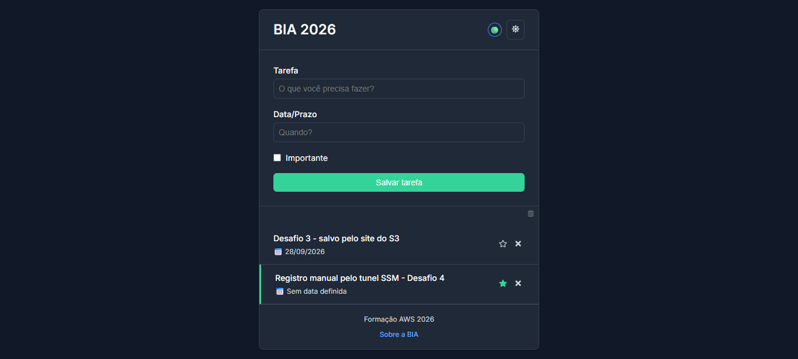

### 24.3 Fechar túneis e parar o porteiro — 💻 T1
`Ctrl+C` na T2 e T3, depois (duas vezes, para provar idempotência):
```bash
cd ~/DESAFIO1/desafio4 && ./04-parar-porteiro.sh "$PORTEIRO" && ./04-parar-porteiro.sh "$PORTEIRO"
```

**✅ Entrega D4:** lançar o porteiro (F22) · túnel RDS 5433 + INSERT (F23) · túnel BIA 3002 + script que para o porteiro (F24).

---

## Fase 25 — Pausar o que cobra por hora

### 25.1 Zerar o service e o ASG — 🖥️ CONSOLE
- **Por quê:** parar só a EC2 do cluster não basta — ela pertence a um **ASG**, que sobe outra e mantém a cobrança; e o service recoloca a task. **Quem manda é a capacidade desejada.**
- ECS › `cluster-bia` › Services › `service-bia` › *Update service* → **Desired tasks 0**.
- EC2 › Auto Scaling Groups › ASG com `cluster-bia` no nome › *Edit* → **Desired 0 · Min 0**.

### 25.2 Parar RDS e bia-dev — 🖥️ CONSOLE
RDS › `bia` › *Actions* › **Stop temporarily** · EC2 › `bia-dev` › *Instance state* › **Stop**.
```bash
aws ec2 describe-instances --filters "Name=instance-state-name,Values=running" --query 'Reservations[].Instances[].Tags[?Key==`Name`]|[].Value' --output text   # vazio
aws rds describe-db-instances --db-instance-identifier "$RDS_ID" --query 'DBInstances[0].DBInstanceStatus' --output text                                  # stopped
```
> O RDS **religa sozinho após 7 dias**. EBS, storage do RDS e ECR seguem cobrando pouco. Ao religar, os IPs públicos mudam: refaça a F16 (e a F21).

---

## Anexos

### Anexo A — Opcional: deploy por commit hash e rollback com o Kiro
Não faz parte da entrega. Com a tag `latest` cada push sobrescreve a anterior e não há rollback. Peça ao agente (🤖, na bia-dev) um `deploy-com-ia.sh`:
```
preciso de sua ajuda agora para gerar um script que me permita fazer deploy e rollback nos meus
ambientes no ecs [...] deploy com base no short commit hash do git, onde cada imagem que subir para
o ecr, tera uma revision na task definition [...] rollback com base na revision da task definition.
voce lista as revisions pra mim e eu escolho [...] antes de criar, me explique o que voce entendeu.
Voce precisa subir a imagem também para o ecr. -> nome do script: deploy-com-ia.sh
```
Esperado — **deploy:** build com tag `<commit>` → push no ECR → nova revisão da `task-def-bia` → `update-service` → `aws ecs wait services-stable`. **Rollback:** lista revisões com a tag de cada uma → aplica a escolhida. (A aula cita também `cluster-bia-alb`; aqui só existe o ambiente sem ALB.)

### Anexo B — Apagar tudo
Ordem: **primeiro quem usa, depois quem é usado** (SG não sai enquanto houver EC2/RDS usando).

1. ECS › `service-bia` › Delete (force)
2. ECS › `cluster-bia` › Delete cluster (apaga o stack: ASG, Launch Template, EC2) — confira em CloudFormation
3. ECS › Task definitions › `task-def-bia` › Deregister › Delete
4. EC2 › Terminate `bia-dev` e `porteiro-bia`
5. RDS › `bia` › Delete (sem snapshot final/retenção) · RDS › Subnet groups › Delete
6. S3 › bucket › Empty › Delete
7. ECR › `bia` › Delete
8. EC2 › SGs `bia-porteiro`, `bia-db`, `bia-web`, `bia-dev`, `bia-dev-ssh` · Key pair `formacao` (+ `~/.ssh/formacao.pem` e o `.pem` de Downloads)
9. IAM › Roles › `role-acesso-ssm`
10. VPC › `bia-vpc` › Delete VPC (leva subnets, rotas, IGW)
11. (opcional) IAM › Users › `formacao_aws`; GitHub › remover a chave `bia-dev`

Validar antes do passo 11 (seis respostas vazias):
```bash
aws ec2 describe-instances --filters "Name=instance-state-name,Values=pending,running,stopping,stopped" --query 'Reservations[].Instances[].InstanceId' --output text
aws rds describe-db-instances --query 'DBInstances[].DBInstanceIdentifier' --output text
aws ecs list-clusters --output text
aws s3 ls
aws ecr describe-repositories --query 'repositories[].repositoryName' --output text
aws ec2 describe-security-groups --filters "Name=group-name,Values=bia-*" --query 'SecurityGroups[].GroupName' --output text
```

### Anexo C — Quando der errado

| Sintoma | Causa provável | Correção |
|---|---|---|
| `ExpiredToken` no WSL | `aws login` venceu (12 h) | `aws login --profile formacao_aws` |
| `AccessDenied` no WSL | Policy ainda não dada ou `AWS_PROFILE` não exportado | Anexo D; `source ~/DESAFIO1/desafio1.sh` |
| `AccessDenied` na bia-dev | Policy faltando na role | 7.3 |
| `iam:PassRole` ao lançar | Falta a inline | 4.2 |
| `$'\r': command not found` | CRLF | `sed -i 's/\r$//' arquivo.sh` |
| EC2 não aparece no SSM | Sem role, sem IP público ou user data rodando | 2.3, 5.1; espere 5 min |
| Cluster com 0 instâncias | Subnet privada no cluster ou IP público desligado | 12.1 |
| Task PENDING no deploy | Porta 80 ocupada pela task anterior | Min running tasks **0%** (14.1) |
| Migrate em timeout | `bia-dev` fora do `bia-db` | 10.2 |
| `database "bia" does not exist` | RDS sem initial database | `npx sequelize db:create` (15.1) |
| `password authentication failed` | `DB_PWD` da task-def ≠ senha RDS | F17 (nova revisão + force deploy) |
| Tela sem tarefas (ECS/S3) | `VITE_API_URL` com IP velho, ou `REACT_APP_API_URL` | F16 / `./deploy.sh hom http://<IP_NOVO>` |
| Site S3 com 403 | Endpoint errado, bloqueio público ou policy | 19.2 (endpoint s3-website) |
| `port is already allocated` 5433/3001 | BIA local ainda no ar | `cd ~/bia && docker compose down` |
| SSH `Connection timed out` | `bia-dev-ssh` fora da máquina ou IP mudou | 5B.1 (My IP de novo) |
| `UNPROTECTED PRIVATE KEY FILE!` | Chave legível por outros / em `/mnt/c` | `chmod 400 ~/.ssh/formacao.pem` |
| `relation "tarefas" does not exist` | Faltaram aspas | `"Tarefas"`, `"createdAt"` |
| `agent "bia" not found` | Kiro fora de `~/bia` | `cd ~/bia` e reabra o chat |
| `Subnet default da zona … nao encontrada` (01) | 01 sem o ajuste da `bia-vpc` | 22.1 |
| `Porteiro … nao esta rodando` (03) | O 03 não liga o porteiro | Rode o 02 antes |
| `psql` em timeout pela 5433 | `bia-porteiro` fora do `bia-db` | 22.3 |

### Anexo D — Permissões finais

| Identidade | Policies | Onde |
|---|---|---|
| `formacao_aws` | `SignInLocalDevelopmentAccess`, `AmazonSSMFullAccess`, `AmazonEC2ContainerRegistryFullAccess` | F1 |
| | inline `PermissaoScriptsIAM`, `AmazonEC2FullAccess` | F4 |
| | `AmazonRDSFullAccess`, `AmazonECS_FullAccess` | F10 |
| | `AmazonS3FullAccess` | F19 |
| `role-acesso-ssm` | `AmazonSSMManagedInstanceCore` | F4 (script) |
| | `AmazonEC2ContainerRegistryPowerUser`, `AmazonECS_FullAccess`, `AmazonEC2FullAccess`, `AmazonRDSFullAccess` | F7 |

> Boa prática (aula): evite credenciais de longa duração; use credencial temporária (`aws login`/STS) ou IAM Identity Center.

### Anexo E — Diferenças em relação à aula

| Tema | Aula | Este roteiro | Motivo |
|---|---|---|---|
| Ambiente | CloudShell + EC2 | WSL + bia-dev | Fundamentais pedem a VM local |
| Rede | VPC default | `bia-vpc` (públicas + privadas, sem NAT) | Banco isolado por roteamento |
| RDS | Public access **Yes** | **No** | Acesso só por SG/túnel |
| Cluster | subnets 1a/1b da default | públicas da `bia-vpc` | Sem NAT, privada não alcança ECR/ECS |
| Min running tasks | 0% (rule do projeto: 50%) | **0%** | Porta 80 fixa numa única EC2 |
| Policy ECS | "AmazonECSFullAccess" | `AmazonECS_FullAccess` | Nome real da managed policy |
| Database no RDS | erro e `db:create` pelo Kiro | `db:create` já previsto | RDS nasce sem initial database |
| Build do React (D3) | `REACT_APP_API_URL` | `VITE_API_URL` | O projeto usa Vite |
| Senhas | aparecem em texto na aula | `<SENHA_RDS>`; compose restaurado com `git checkout` | Não versionar credenciais |
| Kiro | agente com MCP (`aws___run_script`) | `bia.json` sem MCP; variante MCP opcional | Estado do repositório |

### Anexo F — Pontos a confirmar

| Item | O que se sabe | Ação sugerida |
|---|---|---|
| Versão do PostgreSQL | Aula: 18.3-R2; diagnóstico da aula: 16.3; print deste ambiente: 18.3 | Aceitar a padrão do Console |
| Min running tasks | Console deste ambiente: 0%; relatório do Kiro: 50% | Conferir com `describe-services` |
| Onde rodar o diagnóstico | Roteiro: bia-dev (role da instância); o print da entrega foi gerado no terminal local | Ambos funcionam; na bia-dev não depende do `aws login` |
| Evidências das entregas | `BIA_na_porta_80.png` e `Diagnostico_do_Kiro-CLI.png` adotados como evidências (F17/F18) | Opcional: print de reforço com URL e tarefa listada |
| Mensagem do 01 após o ajuste | Se a subnet não for achada, o 01 ainda imprime "Subnet **default** da zona … nao encontrada" | Ler como "subnet `bia-subnet-public2-us-east-1b` não encontrada" |
| Prazo da entrega | "até terça" (aula) | Confirmar na área de membros |
| Domínio (Route 53 / ACM) | Aula sugere registrar um domínio `.br` para a próxima etapa | Fora do escopo desta entrega |

### Anexo G — Material de apoio da pasta `Desafios/`

| Arquivo | Conteúdo | Uso neste roteiro |
|---|---|---|
| `Desafio 1.txt` … `Desafio 4.txt`, `Aula Desafio 4.txt`, `Aulas de apoio desafio 4.txt` | Enunciados e anotações das aulas dos Fundamentais | Fonte dos itens oficiais da tabela de entregas |
| `guia-desafio-1.html` … `guia-desafio-4.html`, `guia-desafio-4-hibrido.html` | Guias anteriores, um por desafio | Consolidados neste README e nos guias da raiz |
| `01-lancar-porteiro-zona-b.sh`, `02-iniciar-porteiro-tunel-rds.sh`, `03-tunel-bia.sh`, `04-parar-porteiro.sh` | **Entregas do D4** | Fases 22–24 |
| `01-zip.sh`, `02-unzip.sh` | Exercício de aula: `zip -r ../bia.zip bia/docker-compose.yml` e `unzip -o bia.zip -d bia2` (`-r` recursivo, `-o` sobrescreve, `-d` pasta de destino) | Não é entrega |
| `04-command_substitution.sh` | Exercício: `INSTANCE_ID=$(aws ec2 describe-instances …)` + `[ -z … ]` — guardar a saída de um comando numa variável e validá-la | Base do padrão usado nos 01–04 |
| `05-1-criar-tunel-propria-ec2.sh`, `05-2-criar-tunel-rds.sh`, `06-1-ligar-porteiro.sh`, `06-2-parar-porteiro.sh` | Versões da aula dos túneis e liga/desliga (profile `desafios-fundamentais` fixo) | Substituídos pelos 01–04 |
| `05-policy-criar-tunel` | Policy mínima para túneis: `ssm:StartSession` nas instâncias e nos documentos `AWS-StartSSHSession`/`AWS-StartPortForwardingSessionToRemoteHost`, mais `DescribeSessions`, `GetConnectionStatus`, `DescribeInstanceProperties`, `ec2:DescribeInstances`, `TerminateSession`, `ResumeSession` | Alternativa de **mínimo privilégio** ao `AmazonSSMFullAccess` do `formacao_aws` (F1), se quiser restringir |

---

> **Evidências:** as imagens em `imagens/` já têm Account ID, IDs de recursos, IPs públicos, endpoint e URIs cobertos.
> Versão só terminal (com as limitações de Console indicadas): `guia-desafio-preparatorio-1.html`. Versão interativa com checklist: `guia-desafio-preparatorio-1-hibrido.html`.
