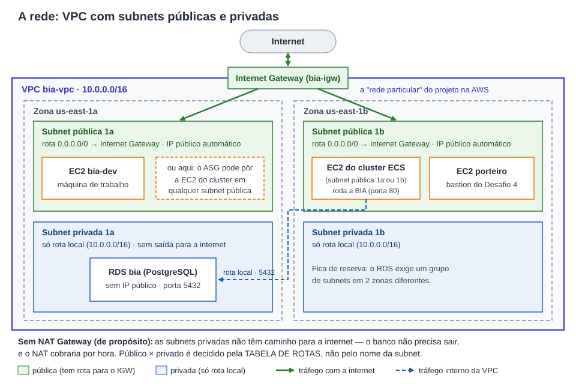
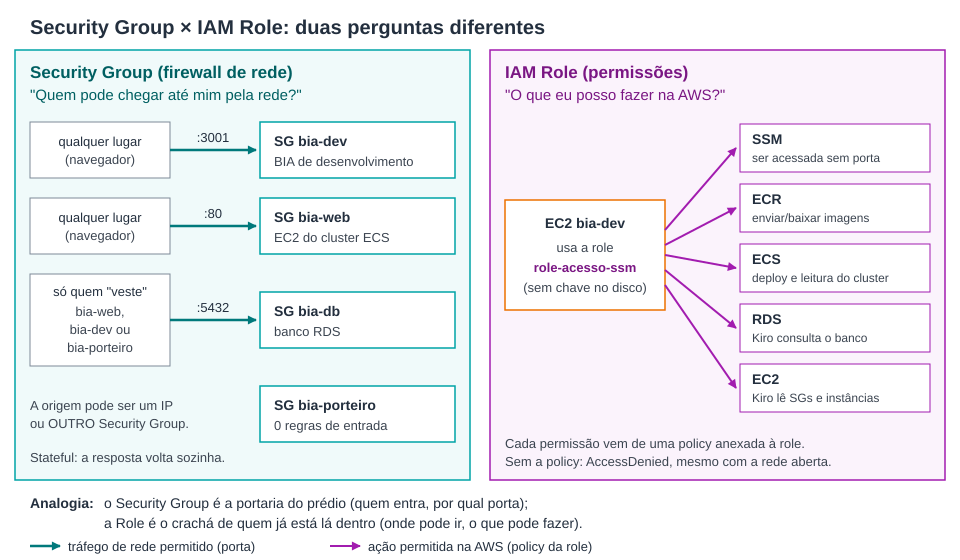
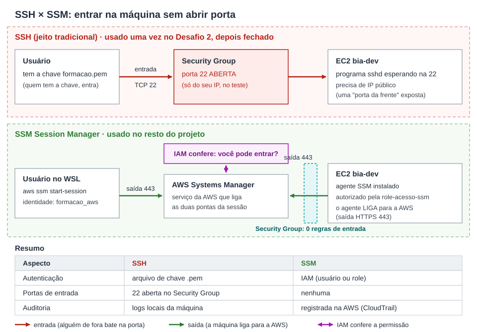
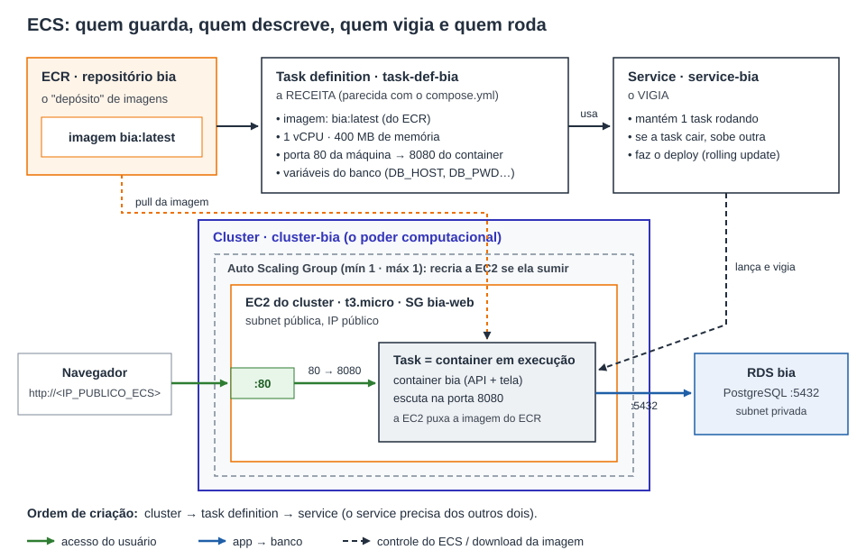
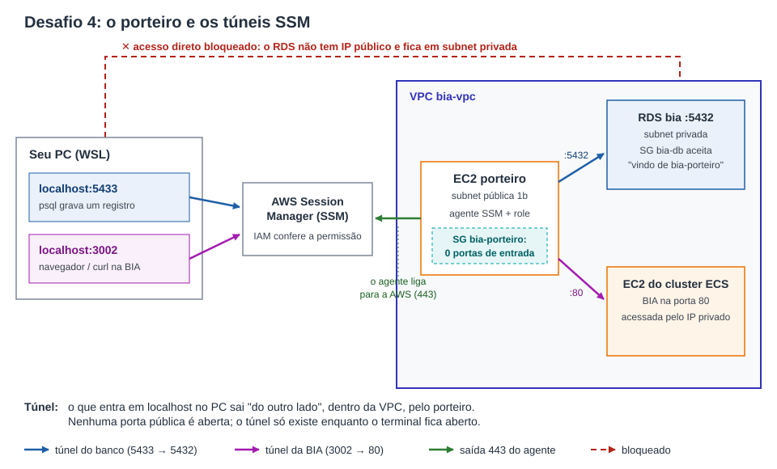

# BIA na AWS — do zero ao ECS, explicado passo a passo

🧩 Para chegar aqui, juntei os desafios anteriores da Fase Fundamentais e construí tudo desde o início, numa sequência única:

- **Desafio 1** — VM Ubuntu 24.04 com VS Code, DBeaver, git, Docker, AWS CLI e SAM; a BIA rodando com Docker, dados persistidos e DBeaver no banco
- **Desafio 2** — VM conectada à AWS por usuário IAM; máquina bia-dev lançada por script e acessada por SSH (teste, depois fechado) e SSM; build e push da imagem para o ECR
- **Desafio 3** — front da BIA servido pelo S3, com script Shell recebendo a URL da API por argumento
- **Desafio 4** — "porteiro" (bastion) com túneis SSM para o RDS (5433) e para a BIA (3002)

> ### ⭐ Preparatório · Desafio 1 — o desafio atual
> Colocar a BIA no **Amazon ECS**, com banco no **RDS**, e usar um **agente de IA** para validar o ambiente. Entregas oficiais:
>
> 1. **Print da BIA rodando na porta 80 na AWS com seu email cadastrado e texto do botão alterado** → [Entrega 1](#etapa-13--as-entregas-do-preparatório-desafio-1)
> 2. **Diagnóstico do KIRO-CLI que nosso projeto está rodando corretamente no ECS** → [Entrega 2](#etapa-13--as-entregas-do-preparatório-desafio-1)

A **BIA** é uma aplicação de tarefas (Node.js + React + PostgreSQL). Aqui ela roda no **Amazon ECS** na porta 80, com o banco no **Amazon RDS** em rede privada, e um agente de IA (**Kiro-CLI**) gerou o diagnóstico do ambiente. Cada desafio usa o que o anterior deixou pronto — por isso o Preparatório D1 veio **antes** dos Desafios 3 e 4, que dependem da API no ECS e do RDS. Este README explica **o que foi feito e por quê**, para um leigo acompanhar; os comandos ficam no guia (veja [Onde ver os comandos](#onde-ver-os-comandos)).

---

## Visão geral

**Como ler o desenho, em linguagem simples:**

1. Você digita o endereço da BIA no navegador. O pedido entra na rede da AWS pelo **Internet Gateway** (a "porta de entrada" da rede para a internet).
2. Ele chega a uma máquina (**EC2**) que pertence ao **cluster ECS**. Nela roda um **container** com a BIA: a porta 80 da máquina é repassada para a porta 8080 do container.
3. Para ler e gravar tarefas, a BIA fala com o banco **RDS** na porta 5432. O banco fica numa parte **privada** da rede, que a internet não alcança.
4. A imagem da aplicação (o "pacote" pronto para rodar) é enviada do meu computador para o **ECR**, e o ECS a busca de lá.
5. A máquina de trabalho **bia-dev** é acessada **sem porta aberta** (via SSM). Dela rodam as migrations do banco e o agente de IA.
6. No Desafio 3, a tela passa a ser servida pelo **S3**; no Desafio 4, um **porteiro** permite chegar ao banco privado por túneis seguros.

---

## A jornada, em ordem

Cada etapa segue o mesmo molde: **o que foi feito**, **o conceito** (com uma analogia do dia a dia), **por que nesta ordem / por que assim**, a **validação** (o print que comprova a etapa, quando existe) e **onde estão os comandos**.

| # | Etapa | Conceito central | Validação |
|---|---|---|---|
| 0 | [Controle de custos](#etapa-0--controle-de-custos-budget) | Budget e alertas | lista de Budgets no Console |
| 1 | [A VM e as ferramentas](#etapa-1--a-vm-e-as-ferramentas) | Ambiente de trabalho | comandos do guia |
| 2 | [A BIA local com Docker](#etapa-2--a-bia-local-com-docker) | Imagem, container, volume, migration | comandos do guia |
| 3 | [Identidade: usuário IAM](#etapa-3--identidade-na-aws-usuário-iam) | Autenticação × autorização | `IAM_users.png` |
| 4 | [A rede: VPC](#etapa-4--a-rede-vpc-subnets-e-internet-gateway) | Subnets públicas e privadas | `VPC_bia.png`, `Subnets.png` |
| 5 | [Security Groups × IAM Role](#etapa-5--security-groups--iam-role) | Rede × permissão | `Security_group.png`, `IAM_policy.png` |
| 6 | [EC2 bia-dev e SSM × SSH](#etapa-6--a-máquina-de-trabalho-bia-dev-e-o-acesso-por-ssm) | Entrar sem abrir porta | `EC2_bia-dev.png`, `Navegador_porta_3001_docker.png` |
| 7 | [ECR](#etapa-7--o-depósito-de-imagens-ecr) | Registro de imagens | `ECR_criacao.png`, `ECR_repositories.png` |
| 8 | [Kiro-CLI](#etapa-8--o-agente-de-ia-kiro-cli) | Agente, contexto, rules | `Kiro_CLI.png` |
| 9 | [RDS privado](#etapa-9--o-banco-gerenciado-rds-privado) | Banco gerenciado | `RDS_banco_dados.png` |
| 10 | [Amazon ECS](#etapa-10--rodar-a-aplicação-amazon-ecs) | Cluster, task definition, service | `ECS_clusters.png` |
| 11 | [Migrations no RDS](#etapa-11--criar-as-tabelas-migrations-no-rds) | Estrutura do banco em código | comandos do guia |
| 12 | [Deploy](#etapa-12--publicar-a-versão-nova-deploy) | Tag `latest`, novo deploy | `ECS_deploy.png` |
| 13 | [Entregas 1 e 2](#etapa-13--as-entregas-do-preparatório-desafio-1) | Prova ponta a ponta | `BIA_na_porta_80.png`, `Diagnostico_do_Kiro-CLI.png` |
| 14 | [Desafio 3: S3](#etapa-14--desafio-3-o-front-no-s3) | Site estático | `S3_Buckets_1.png`, `S3_Buckets_2.png`, `S3_Buckets_BIA_navegador.png` |
| 15 | [Desafio 4: porteiro](#etapa-15--desafio-4-o-porteiro-e-os-túneis-ssm) | Bastion e túneis | `BIA_tunel_porteiro.png` |
| 16 | [Pausar ou apagar](#etapa-16--pausar-ou-apagar-controlar-custos) | Custos | comandos do guia |

---

### Etapa 0 — Controle de custos (Budget)

**O que foi feito.** Antes de criar qualquer recurso, configurei um **budget** (orçamento mensal) no Billing da AWS, com alerta por e-mail.

**Conceito.** A AWS cobra pelo uso; várias peças deste projeto cobram **por hora** enquanto estão ligadas. O budget não bloqueia nada — ele **avisa** quando o gasto se aproxima do limite escolhido. *Analogia:* o alerta do app do banco quando a fatura do cartão passa de um valor.

**Por que primeiro.** O aviso precisa existir antes do primeiro recurso que cobra. O outro lado do controle de custos é pausar ou apagar tudo no fim ([Etapa 16](#etapa-16--pausar-ou-apagar-controlar-custos)).

📸 **Validação:** sem print — o budget aparece na lista de Budgets.

**Onde fazer:** no Console, Billing and Cost Management › Budgets › *Create budget* › modelo **Monthly cost budget** (nome, valor mensal aceito e e-mail para os alertas). O valor do limite é escolha de cada um.

---

### Etapa 1 — A VM e as ferramentas

**O que foi feito.** Preparei o ambiente de trabalho: um **Ubuntu 24.04** rodando dentro do Windows pelo **WSL**, fazendo o papel da "VM" do desafio. Nele: git, Docker, AWS CLI (com o plugin do Session Manager), Node, cliente do PostgreSQL e AWS SAM. No Windows: VS Code (ligado ao Ubuntu) com a extensão GitHub Pull Requests autenticada, e o DBeaver.

**Conceito.**
- **VM (máquina virtual)** é um computador "de mentira" rodando dentro do seu computador de verdade, com sistema operacional próprio. *Analogia:* um apartamento dentro de um prédio — tem cozinha e banheiro próprios, mas usa a estrutura do prédio.
- **WSL** é o recurso do Windows que roda um Linux de verdade lado a lado com o Windows.
- **AWS CLI** é o "controle remoto" da AWS pelo terminal: tudo o que se faz clicando no Console também pode ser feito por comando.
- **git** guarda o histórico de alterações do código; **DBeaver** é um programa visual para olhar dentro de bancos de dados.

**Por que assim.** Todo comando local do projeto é Bash (Linux). O projeto foi clonado **no disco do Linux**, não no disco do Windows: lá as quebras de linha dos scripts ficam no padrão Linux e o Bash não falha com o erro `$'\r': command not found` (o `\r` é o pedaço extra da quebra de linha do Windows, CRLF, que o Linux não entende).

📸 **Validação:** sem print — cada ferramenta responde com a sua versão no terminal.

**Comandos:** guia híbrido, Fase 0.

---

### Etapa 2 — A BIA local com Docker

**O que foi feito.** Subi a BIA no meu computador com **Docker Compose** — três containers: a aplicação (server), o banco PostgreSQL (database) e um redis. Criei a tabela de tarefas com uma **migration**, cadastrei uma tarefa, derrubei e subi tudo de novo para provar que o dado **não se perdeu**, e abri o banco no DBeaver.

**Conceito.**

| Termo | O que é | Analogia |
|---|---|---|
| **Docker × VM** | A VM virtualiza o *hardware* e carrega um sistema operacional inteiro. O Docker isola só a aplicação e **compartilha o núcleo (kernel)** do sistema da máquina — por isso é mais leve e sobe em segundos. | VM = casa inteira; container = quarto mobiliado numa casa que já existe |
| **Imagem** | O "pacote" pronto, com a aplicação e tudo de que ela precisa. Não muda. | A receita de bolo impressa |
| **Container** | Uma imagem **em execução**. Dá para ter vários a partir da mesma imagem. | O bolo assado a partir da receita |
| **Volume** | Uma pasta guardada **fora** do container, onde o banco grava os dados. | Um cofre fora da cozinha: jogar o bolo fora não apaga o cofre |
| **Migration** | Um arquivo de código que descreve a estrutura do banco (criar a tabela `Tarefas`). *up* aplica, *down* desfaz. | A planta da estante, versionada junto com o projeto |
| **Docker Compose** | Um arquivo (`compose.yml`) que descreve vários containers e sobe todos com um comando. | A lista de pratos de um jantar, preparada de uma vez |

**Por que assim.** Um banco recém-criado vem **vazio** — sem tabelas. Sem a migration, a tela abre, mas nada é salvo. E sem volume, apagar o container apagaria os dados junto. Ao terminar, a BIA local foi derrubada para liberar a memória e a porta 5433, que o Desafio 4 usa depois.

📸 **Validação:** sem print — a tarefa "teste local" reaparece depois de derrubar e subir os containers, e o DBeaver mostra a tabela `Tarefas`.

**Comandos:** guia híbrido, Fase 0B.

---

### Etapa 3 — Identidade na AWS: usuário IAM

**O que foi feito.** No Console, com o administrador da conta, criei o usuário **`formacao_aws`**, que passou a ser a identidade do meu terminal. Ele começou com só três permissões (login pelo terminal, sessões SSM e envio de imagens ao ECR). O terminal entra com `aws login`, que gera uma **credencial temporária** (válida por 12 horas).

**Conceito.**
- **IAM** (Identity and Access Management) é o serviço que responde duas perguntas: **quem é você?** (autenticação) e **o que você pode fazer?** (autorização).
- **Usuário IAM** é uma identidade para uma pessoa ou programa. **Policy** é um documento com a lista do que é permitido.
- **Credencial temporária** expira sozinha; se vazar, perde o valor em poucas horas. *Analogia:* uma pulseira de evento que vale só naquele dia, em vez de uma cópia da chave de casa.
- **Mínimo privilégio**: dar só o necessário. Aqui as permissões foram entrando **aos poucos**, cada vez que um comando respondia `AccessDenied`.

**Por que nesta ordem.** Tudo o que vem depois (ler a rede, lançar máquinas, criar banco) é feito "em nome de alguém". Primeiro vem a identidade, depois os recursos.

📸 **Validação** — usuário `formacao_aws` criado na conta:

**Comandos:** guia híbrido, Fase 1.

---

### Etapa 4 — A rede: VPC, subnets e Internet Gateway

**O que foi feito.** Criei uma **VPC própria**, a `bia-vpc` (faixa de endereços `10.0.0.0/16`), com o assistente "VPC and more": duas **zonas de disponibilidade** (us-east-1a e us-east-1b), duas **subnets públicas**, duas **subnets privadas**, as **tabelas de rotas** e um **Internet Gateway**. Depois liguei o "IP público automático" só nas subnets públicas.

**Conceito.**

| Peça | O que é / para que serve | Analogia |
|---|---|---|
| **VPC** | Uma rede particular e isolada dentro da AWS. Todo servidor e banco vive dentro de uma. | Um condomínio fechado |
| **Subnet** | Um pedaço da VPC, preso a uma zona. | As ruas do condomínio |
| **Subnet pública** | Tem rota para a internet (`0.0.0.0/0 → Internet Gateway`). | Rua com saída para a avenida |
| **Subnet privada** | Só tem a rota **local** (fala com o resto da VPC, nunca com a internet). | Rua interna, sem saída |
| **Internet Gateway** | A ligação da VPC com a internet. | O portão do condomínio |
| **Tabela de rotas** | A lista de "para chegar em X, vá por Y". É ela que torna uma subnet pública ou privada. | As placas de trânsito |
| **Zona de disponibilidade (AZ)** | Um data center separado dentro da região. Duas zonas = se uma cair, a outra segue. | Dois prédios do mesmo condomínio, em quarteirões diferentes |

**Por que assim.**
- **VPC própria em vez da padrão (diferente da aula):** para separar o que precisa de internet (máquinas) do que **não pode** ser alcançado por ela (o banco). O banco fica protegido **pelo roteamento**, e não só pelo firewall.
- **Duas zonas:** o RDS exige subnets em duas zonas; a bia-dev ficou na 1a, o porteiro na 1b, e a EC2 do cluster ECS pode nascer em qualquer uma das duas subnets públicas (quem escolhe é o Auto Scaling Group).
- **Sem NAT Gateway:** o NAT daria saída à internet para as subnets privadas, mas cobra por hora — e o banco não precisa sair. Consequência: toda máquina que precisa falar com serviços da AWS (SSM, ECR, ECS) fica numa subnet **pública**, com IP público.
- **VPC primeiro:** tudo o que vem depois (firewalls, máquinas, banco, cluster) é criado **dentro** dela, e isso não se troca depois.

📸 **Validação** — `bia-vpc` disponível, ao lado da VPC padrão da conta:

📸 **Validação** — as 4 subnets (públicas e privadas, nas zonas 1a e 1b) e o IP público automático ligado:

**Comandos:** guia híbrido, Fase 2.

---

### Etapa 5 — Security Groups × IAM Role

**O que foi feito.** Criei os firewalls da máquina de trabalho — o Security Group **`bia-dev`** (porta 3001, onde a BIA de desenvolvimento responde) e o **`bia-dev-ssh`** (porta 22 só do meu IP, usado uma única vez) — e o par de chaves `formacao` para o SSH. Em seguida, rodei o script do projeto que cria a **role `role-acesso-ssm`**. Ele falhou com `AccessDenied`: o usuário ainda não podia criar roles. Dei ao `formacao_aws` uma policy própria (`PermissaoScriptsIAM`) com apenas as ações de IAM do script, mais o `AmazonEC2FullAccess`, e rodei de novo.

**Conceito.** São duas perguntas diferentes, que costumam ser confundidas:

| | **Security Group** | **IAM Role** |
|---|---|---|
| Pergunta | *"Quem pode chegar até mim pela rede?"* | *"O que eu posso fazer na AWS?"* |
| Controla | Portas e origens (firewall) | Ações nos serviços (permissões) |
| Analogia | A portaria do prédio | O crachá de quem já está lá dentro |

- O Security Group é **stateful**: se a entrada foi permitida, a resposta volta sozinha.
- A **role** é uma identidade que uma **máquina** "veste". A EC2 recebe credenciais temporárias automaticamente, sem nenhuma chave gravada no disco.
- **`iam:PassRole`** é a permissão de "entregar uma role a uma máquina". É delegar poder, por isso não vem em pacotes genéricos como o `AmazonEC2FullAccess` — precisou entrar na policy própria.

**Por que nesta ordem.** O Security Group e o par de chaves precisam existir **antes** de lançar a máquina (a chave só pode ser escolhida no lançamento). A role também: sem ela, a máquina nunca aparece no SSM. E o SG do SSH ficou **separado**, para a porta 22 sair com um clique depois do teste.

📸 **Validação** — Security Groups na `bia-vpc`. *(Print tirado depois da criação dos SGs de produção da Etapa 9: mostra `bia-dev`, `bia-web` e `bia-db`.)*

📸 **Validação** — permissões do `formacao_aws`, com a policy `PermissaoScriptsIAM` e o `AmazonEC2FullAccess`. *(Print tirado mais tarde: já inclui as policies de RDS e ECS, anexadas na Etapa 9.)*

**Comandos:** guia híbrido, Fases 3 e 4.

---

### Etapa 6 — A máquina de trabalho bia-dev e o acesso por SSM

**O que foi feito.** Lancei a EC2 **`bia-dev`** (t3.micro, Amazon Linux 2023) **por script**, na subnet pública da zona 1a, com a role `role-acesso-ssm` e um *user data* que instala Docker, git, Node e o resto no primeiro boot. Entrei nela pelo **SSM**. Para cumprir o Desafio 2, também entrei **uma vez por SSH**, comparei as duas formas e depois **retirei a porta 22**. Por fim, fiz o fork da BIA no GitHub, clonei na bia-dev e rodei a aplicação ali, na porta 3001.

**Conceito.**
- **EC2** é um servidor virtual alugado por hora na AWS.
- **User data** é um roteiro que a máquina executa sozinha ao ligar pela primeira vez.
- **SSH** é o jeito tradicional de entrar num servidor Linux: exige uma **porta de entrada aberta (22)**, um **IP público** e um **arquivo de chave (.pem)**. Quem tem o arquivo, entra.
- **SSM Session Manager** inverte a lógica: um **agente** instalado na EC2 **liga para a AWS** (saída HTTPS 443). Quando você pede uma sessão, o **IAM confere** se você tem permissão e o Systems Manager conecta as duas pontas. **Nenhuma porta de entrada fica aberta**, e cada sessão fica registrada (CloudTrail). *Analogia:* em vez de deixar a porta da frente destrancada esperando visita, o morador liga para a central e a central só transfere a chamada de quem está na lista.

A prova prática: numa sessão SSH, a variável `$SSH_CLIENT` mostra o meu IP e a porta 22; numa sessão SSM, ela vem **vazia** — nada entrou pela 22. Depois de retirar o SG `bia-dev-ssh`, o SSH passa a dar *timeout* e o SSM continua funcionando.

**Por que assim.**
- **Por script:** o Desafio 2 pede o lançamento por script. O script do projeto usa a VPC padrão; a versão usada aqui procura a `bia-vpc` pelo nome e não cria máquina duplicada.
- **Fork:** é a minha cópia do projeto; é nele que o botão alterado (Etapa 12) foi commitado.
- **Endereço da API no build:** a tela da BIA roda **no navegador**, então o endereço da API é gravado na hora de montar a imagem. Na bia-dev esse endereço foi o IP público dela (porta 3001), e não `localhost`. Ao final, a alteração foi desfeita e a BIA derrubada, para não versionar o IP e liberar memória.

📸 **Validação** — `bia-dev` rodando (t3.micro, 3/3 verificações, IP privado da `bia-vpc`):

📸 **Validação** — BIA na bia-dev, porta 3001, gravando tarefa (botão ainda com o texto original, *Add New Task*):

**Comandos:** guia híbrido, Fases 5, 5B e 6.

---

### Etapa 7 — O depósito de imagens: ECR

**O que foi feito.** Criei o repositório privado **`bia`** no **Amazon ECR**. Testei o acesso pelo meu terminal (usuário) e pela bia-dev (role) — na bia-dev deu `AccessDenied` até eu anexar à role as policies de ECR, ECS, EC2 e RDS. Depois, no meu computador, fiz o **build** da imagem da BIA, dei a ela o endereço do repositório (**tag**) e fiz o **push** (envio).

**Conceito.**
- **ECR** (Elastic Container Registry) é um **registro de imagens**: um depósito privado de onde servidores baixam a imagem pronta. *Analogia:* uma biblioteca onde você guarda a receita de bolo para qualquer cozinha buscar.
- **Build** monta a imagem a partir do `Dockerfile`. **Tag** é a etiqueta da versão (aqui, `latest`). **Push** envia; **pull** baixa.
- Nos próximos envios, só as **camadas** alteradas sobem.

**Por que assim.** O ECS **não faz build**: ele só baixa uma imagem pronta. Por isso o ECR vem antes do ECS. E o teste pela bia-dev mostrou um ponto importante: **a EC2 não usa as credenciais do meu terminal** — ela só pode o que a role dela pode.

📸 **Validação** — repositório privado `bia` criado:

📸 **Validação** — imagem `latest` (~215 MB) enviada pelo push:

**Comandos:** guia híbrido, Fases 7 e 8.

---

### Etapa 8 — O agente de IA: Kiro-CLI

**O que foi feito.** *(Aqui começa o Preparatório D1.)* Instalei o **Kiro-CLI** na bia-dev, fiz login (plano gratuito) e conversei com o agente **`bia`**, que já vem configurado dentro do projeto. Perguntei quais regras de infraestrutura ele conhecia; a resposta citou os nomes e limites do projeto (`cluster-bia`, `service-bia`, SGs `bia-*`, 1 vCPU / 400 MB).

**Conceito.**
- **Agente de IA** é um assistente que não só conversa, mas **executa ações** (rodar comandos, consultar a AWS, ler arquivos) — sempre pedindo aprovação.
- **Contexto** são os arquivos que o agente lê antes de responder (README, documentação do projeto).
- **Rules** são as regras do projeto que o agente deve seguir: nomes padronizados, tamanho da task, estratégia de deploy. *Analogia:* o manual de boas-vindas que um funcionário novo lê antes de começar.
- O agente `bia` usa o **AWS CLI com a role da bia-dev** — nenhuma chave gravada no disco.
- **MCP Server** (visto na imersão): um "conector" que expõe ferramentas ao agente de forma padronizada e auditável (por exemplo, para consultar um banco ou a AWS). O projeto traz uma variante opcional com MCP, mas o agente usado aqui não depende dela.

**Por que aqui.** O Kiro roda na bia-dev para usar a **role da instância**. Ele ajudou na investigação de problemas ao longo do caminho e produz a Entrega 2.

📸 **Validação** — Kiro autenticado na bia-dev, agente `bia` ativo na pasta do projeto:

**Comandos:** guia híbrido, Fase 9.

---

### Etapa 9 — O banco gerenciado: RDS privado

**O que foi feito.** Primeiro, dei ao `formacao_aws` as permissões de RDS e ECS e criei os firewalls de produção: **`bia-web`** (porta 80 aberta para qualquer lugar) e **`bia-db`** (porta 5432 aceita **só** de quem veste `bia-web` ou `bia-dev`). Depois criei o banco **`bia`** no **Amazon RDS** (PostgreSQL, db.t3.micro, zona 1a), dentro da `bia-vpc`, **sem acesso público**, protegido só pelo `bia-db`. A senha, gerada automaticamente, foi guardada fora do repositório.

**Conceito.**
- **RDS** é um banco de dados **gerenciado**: a AWS cuida do servidor, das atualizações e dos backups; você só usa o banco. *Analogia:* alugar um apartamento com síndico e manutenção, em vez de construir a casa e consertar o encanamento.
- **Endpoint** é o endereço (nome DNS) pelo qual a aplicação encontra o banco.
- **Origem = outro Security Group:** a regra do `bia-db` não libera um IP, e sim "quem veste o SG `bia-web`". Se o ECS trocar a máquina (e o IP mudar), a regra continua valendo.

**Por que assim.**
- **Banco fora das máquinas:** a task do ECS pode morrer e renascer; o banco precisa sobreviver a isso.
- **`bia-web` antes de `bia-db`:** a regra do banco aponta para o `bia-web`, então ele precisa existir antes.
- **Sem acesso público (diferente da aula):** de fora, só se chega ao banco por túnel (Desafio 4).
- **Sem "initial database":** o banco `bia` nasce na Etapa 11, pelas próprias migrations.

📸 **Validação** — banco `bia` PostgreSQL disponível, na zona us-east-1a:

**Comandos:** guia híbrido, Fases 10 e 11.

---

### Etapa 10 — Rodar a aplicação: Amazon ECS

**O que foi feito.** Montei as três peças do ECS, nesta ordem:

1. **Cluster `cluster-bia`** com uma EC2 t3.micro (mínimo 1, máximo 1), nas **subnets públicas**, com o SG `bia-web` e IP público.
2. **Task definition `task-def-bia`**: imagem `bia:latest` do ECR, 1 vCPU, ~400 MB de memória, porta 80 da máquina → 8080 do container, e as variáveis de conexão com o banco.
3. **Service `service-bia`**: mantém **1 task** rodando, com atualização gradual (*rolling update*).

**Conceito.**

| Peça | O que é | Analogia |
|---|---|---|
| **ECS** | Serviço da AWS que roda e cuida de containers | A gerência de um restaurante |
| **Cluster** | O poder computacional: as máquinas onde os containers rodam | A cozinha |
| **Auto Scaling Group (ASG)** | Mantém a quantidade desejada de máquinas; se uma some, cria outra | O gerente que chama um cozinheiro substituto |
| **Task definition** | A receita: qual imagem, quanta CPU/memória, portas, variáveis. Cada mudança vira uma nova *revisão* (`:1`, `:2`…) | A ficha técnica do prato |
| **Service** | O vigia: mantém N tasks rodando e repõe as que caem | O chefe que garante que o prato nunca falte no balcão |
| **Task** | O container efetivamente rodando | O prato sendo servido |

**Por que assim.**
- **Por que ECS e não "uma EC2 na mão":** subir outra máquina manualmente quando a anterior cai é **reagir** à falha, não escalar. Com o ECS, a imagem versionada no ECR é executada por um service que se recupera sozinho.
- **Por que EC2 e não Fargate:** Fargate dispensa gerenciar máquinas, mas, com a mesma capacidade, custa cerca de **3× mais** (dado da aula).
- **Subnets públicas no cluster (diferente da aula):** sem NAT, uma máquina em subnet privada não alcança o ECR nem o ECS — e nunca se registraria no cluster.
- **Ordem cluster → task definition → service:** o service precisa saber **onde** rodar (cluster) e **o quê** rodar (task definition).
- **Mínimo de tasks em 0% durante o deploy:** com uma única máquina e a porta 80 fixa, a task nova só sobe quando a antiga libera a porta. Com 50%, o deploy travaria.
- **Sem load balancer (ALB):** o endereço da BIA é o IP público da EC2 do cluster.

📸 **Validação** — `cluster-bia` criado, com 1 EC2 registrada (ainda sem service):

**Comandos:** guia híbrido, Fases 12, 13 e 14.

---

### Etapa 11 — Criar as tabelas: migrations no RDS

**O que foi feito.** Criar o RDS **não cria tabelas**. Na bia-dev, apontei temporariamente o `compose.yml` para o endpoint do RDS e rodei as migrations. A primeira tentativa respondeu `database "bia" does not exist`; criei o banco (`db:create`) e rodei de novo: tabela `Tarefas` criada. Em seguida, **desfiz a alteração** do `compose.yml`.

**Conceito.** A **migration** (Etapa 2) é a planta da estrutura do banco guardada no código. Rodá-la contra o RDS cria no banco de produção a mesma estrutura do ambiente local.

**Por que assim.**
- **Pela bia-dev:** o `bia-db` aceita a porta 5432 vinda do SG `bia-dev`, e o container da aplicação já tem a ferramenta de migrations.
- **Ler o erro:** `database "bia" does not exist` é uma **boa notícia** — prova que a rede e a senha funcionaram (senão seria *timeout* ou falha de autenticação).
- **Desfazer depois:** com a senha do banco no `compose.yml`, o próximo build poderia levá-la para a imagem no ECR ou para um commit.

📸 **Validação:** sem print — a resposta `criar-tarefas: migrated`.

**Comandos:** guia híbrido, Fase 15.

---

### Etapa 12 — Publicar a versão nova: deploy

**O que foi feito.** Na bia-dev, apontei o front para o IP público do ECS, **troquei o texto do botão** (de *Add New Task* para *Salvar tarefa*), fiz commit e push no meu fork e rodei o `deploy.sh` do projeto. Ele faz o build, envia a imagem ao ECR e pede ao ECS um **novo deploy**.

**Conceito.**
- **Deploy** é colocar a versão nova no ar.
- **Tag `latest`:** a imagem nova é enviada com a **mesma etiqueta** da anterior. Para o ECS, "nada mudou" — por isso o script usa o **force new deployment**, que obriga o service a subir uma task nova e baixar a imagem de novo. *Analogia:* trocar o conteúdo da caixa sem trocar a etiqueta; é preciso avisar o entregador para buscar de novo.
- **Rolling update:** a task antiga sai e a nova entra, sem intervenção manual.
- O botão novo é a **prova visual** de que a imagem nova chegou ao ECS.

**Por que assim.** A tag `latest` é simples, mas sobrescreve a versão anterior e não permite voltar atrás. Na imersão foi visto um caminho melhor — **deploy versionado pelo hash do commit, com rollback** escolhendo a revisão da task definition —, que ficou fora desta entrega.

📸 **Validação** — `service-bia` com 1 task rodando, deploy concluído com sucesso, rolling update 0% mín / 100% máx:

**Comandos:** guia híbrido, Fase 16.

---

### Etapa 13 — As entregas do Preparatório Desafio 1

#### Entrega 1 — BIA na porta 80, com e-mail cadastrado e botão alterado

**O que foi feito.** Abri a BIA no navegador pelo IP público do ECS (sem número de porta = porta 80), cadastrei meu e-mail como tarefa e usei o botão com o texto novo.

**Por que isso prova tudo.** Uma tarefa gravada pela tela e lida do banco só funciona se **imagem, ECS, rede e RDS** estiverem ligados corretamente. O botão *Salvar tarefa* prova que é a **imagem nova**.

📸 **Entrega 1** — BIA servida pelo ECS na porta 80, com o e-mail no campo *Tarefa* e o botão **Salvar tarefa**:

> Observação: o print mostra o e-mail no campo e o botão alterado; ele foi feito sem a barra de endereço e antes de a tarefa aparecer na lista.

#### Entrega 2 — Diagnóstico do Kiro-CLI

**O que foi feito.** Pedi ao agente `bia` um diagnóstico confirmando que a aplicação está rodando corretamente no ECS e se comunicando com o RDS. O agente consultou a AWS, leu os logs, testou a API e montou um relatório.

**Conceito.** É o uso prático do agente de IA: em vez de abrir dez telas do Console, uma pergunta em linguagem natural gera um **relatório** verificável, com cada item consultado na conta.

📸 **Entrega 2** — relatório do Kiro-CLI sobre o projeto no ECS:

| O relatório confirmou | Detalhe |
|---|---|
| RDS | `bia` disponível, PostgreSQL, db.t3.micro, SG `bia-db` |
| Cluster | `cluster-bia` ativo, EC2 t3.micro rodando, agente ECS conectado |
| Service e task | `service-bia` ativo, 1 desejada / 1 rodando, `task-def-bia:1`; mapeamento de portas host 80 → container 8080 (o relatório escreve "8080 → 80") |
| API | `/api/versao` respondendo "Bia 4.3.0"; log `Servidor rodando na porta 8080` |

> Observação: para `/api/tarefas`, o relatório registrou uma divergência na credencial do banco (`DB_PWD` da task definition diferente da senha do RDS). O procedimento de correção — criar uma nova revisão da task definition com a senha certa e fazer um novo deploy do service — está descrito no guia híbrido, Fase 17.

**Comandos:** guia híbrido, Fases 17 e 18.

---

### Etapa 14 — Desafio 3: o front no S3

**O que foi feito.** Criei um **bucket S3** configurado como **site estático**, com uma policy que deixa qualquer pessoa **apenas ler** os arquivos. Escrevi um script Shell que recebe o ambiente (`hom` ou `prd`) e a **URL da API por argumento**, faz o build do React com essa URL e sincroniza os arquivos com o bucket. Pelo site do S3, salvei uma tarefa — que foi gravada no RDS pela API do ECS.

**Conceito.**
- **S3** é um armazenamento de arquivos na AWS; um **bucket** é uma "pasta raiz" com nome único no mundo.
- **Site estático** é um site feito só de arquivos prontos (HTML, JavaScript, imagens), sem servidor processando nada. O S3 consegue entregá-los direto ao navegador. *Analogia:* um folheto impresso — basta entregar; a "conversa" com o banco acontece pela API.
- **URL da API gravada no build:** o React vira arquivos estáticos, então o endereço da API fica **escrito dentro do JavaScript** no momento do build. Por isso ele vem por argumento, e mudar o IP do ECS exige novo build e novo envio.
- **Sync** transforma o bucket num espelho do build: envia o que é novo e apaga o que não existe mais.

**Por que assim.** Separa o front (arquivos baratos no S3) da API (no ECS). O script valida os argumentos e aborta se algo faltar — nada é enviado ao S3 por engano. O registro vai para o **RDS**, não para o bucket.

📸 **Validação** — bucket `bia-assets-…` criado em us-east-1:

📸 **Validação** — arquivos do build do React sincronizados no bucket:

📸 **Validação** — registro "Desafio 3 - salvo pelo site do S3" gravado pelo site:

**Comandos:** guia híbrido, Fases 19 a 21.

---

### Etapa 15 — Desafio 4: o porteiro e os túneis SSM

**O que foi feito.** Lancei por script uma pequena EC2, o **porteiro**, na subnet pública da zona 1b, com um Security Group **sem nenhuma porta de entrada**. Atenção aos nomes parecidos: **`porteiro-bia`** é o nome da **instância** (a máquina) e **`bia-porteiro`** é o nome do seu **Security Group** (o firewall). Adicionei ao `bia-db` a regra "acesso vindo de bia-porteiro" — ou seja, a porta 5432 aceita quem veste esse SG. Abri dois **túneis SSM** a partir do meu computador:

- `localhost:5433` → porteiro → **RDS :5432** — por ele, gravei um registro direto no banco com o `psql`;
- `localhost:3002` → porteiro → **EC2 do cluster :80** (pelo IP privado) — por ele, vi a BIA listando esse registro.

No fim, um quarto script **para o porteiro** (e rodar de novo com ele já parado não dá erro).

**Conceito.**
- **Bastion ("porteiro")** é uma máquina cuja única função é servir de ponte para recursos que não têm acesso público.
- **Túnel** faz uma porta do seu computador (`localhost:5433`) "sair do outro lado", dentro da VPC. *Analogia:* uma passagem subterrânea entre a sua casa e o cofre do banco — ninguém na rua vê a passagem, e ela só existe enquanto você a mantém aberta.
- Como o túnel usa o **SSM**, o porteiro não precisa de porta aberta: vale a mesma lógica da Etapa 6.
- **Idempotente:** um script que pode ser rodado de novo sem estragar nada (não duplica o porteiro, não dá erro ao parar o que já está parado).

**Por que assim.** O RDS é privado de propósito (Etapa 9). O porteiro dá acesso **controlado pelo IAM**, sem abrir o banco para a internet — e fica **parado** quando não está em uso, para não cobrar.

📸 **Validação** — o registro do Desafio 3 e o registro manual gravado pelo túnel do banco, vistos pela BIA na porta 3002:

**Comandos:** guia híbrido, Fases 22 a 24; scripts em [`Desafios/`](Desafios/).

---

### Etapa 16 — Pausar ou apagar: controlar custos

**O que foi feito.** Ao terminar, zerei o service e o Auto Scaling Group do cluster, parei o RDS e a bia-dev (o porteiro já estava parado).

**Conceito.**

| Cobra por hora | Cobra por GB guardado | Não cobra |
|---|---|---|
| bia-dev, porteiro, EC2 do cluster, RDS, cada IPv4 público | S3 e ECR (centavos) | VPC, Security Groups, roles, usuários |

**Por que assim.**
- **Por que zerar o ASG:** parar só a EC2 do cluster não adianta — o ASG percebe que falta uma máquina e **cria outra**, e o service recoloca a task. Quem manda é a **capacidade desejada**: com ela em 0, nada sobe.
- **RDS parado religa sozinho após 7 dias.** Discos, armazenamento do RDS e ECR continuam cobrando pouco.
- Ao religar, os **IPs públicos mudam**: é preciso refazer o deploy (Etapa 12) e o envio do site (Etapa 14).
- **Apagar tudo** segue a ordem "primeiro quem usa, depois quem é usado": service → cluster → máquinas → banco → bucket e ECR → Security Groups → role → VPC.

📸 **Validação:** sem print — nenhuma instância em execução e o RDS em `stopped`.

**Comandos:** guia híbrido, Fase 25 e a seção "Apagar tudo para recomeçar do zero".

---

## Glossário

| Termo | Em uma linha |
|---|---|
| **AWS CLI** | Programa de terminal que executa na AWS o mesmo que o Console faz com cliques. |
| **Auto Scaling Group (ASG)** | Mantém a quantidade desejada de EC2; se uma some, cria outra. |
| **Bastion (porteiro)** | Máquina-ponte para chegar a recursos sem acesso público. |
| **Bucket** | "Pasta raiz" do S3, com nome único no mundo. |
| **Build** | Montar a aplicação (ou a imagem Docker) a partir do código. |
| **CIDR (10.0.0.0/16)** | Forma de escrever uma faixa de endereços IP. |
| **Cluster (ECS)** | O conjunto de máquinas onde os containers rodam. |
| **Container** | Uma imagem em execução, isolada das demais. |
| **Deploy** | Colocar uma versão nova da aplicação no ar. |
| **Docker** | Ferramenta que empacota e roda aplicações em containers. |
| **EC2** | Servidor virtual alugado por hora na AWS. |
| **ECR** | Depósito privado de imagens Docker na AWS. |
| **ECS** | Serviço que roda containers e os mantém de pé. |
| **Endpoint** | Endereço pelo qual se acessa um serviço (ex.: o banco). |
| **IAM** | Serviço de identidades e permissões da AWS. |
| **Imagem** | Pacote imutável com a aplicação e suas dependências. |
| **Internet Gateway** | Ligação entre a VPC e a internet. |
| **Kiro-CLI** | Agente de IA de terminal que consulta e opera a AWS. |
| **MCP Server** | Conector padronizado que expõe ferramentas a um agente de IA (visto na imersão). |
| **Migration** | Arquivo de código que cria ou altera a estrutura do banco. |
| **NAT Gateway** | Dá saída à internet para subnets privadas; não usado aqui (custo). |
| **Policy** | Documento com o que uma identidade pode ou não fazer. |
| **RDS** | Banco de dados gerenciado pela AWS. |
| **Região / Zona (AZ)** | Região é a localização (us-east-1); zona é um data center separado dentro dela. |
| **Role** | Identidade que uma máquina ou serviço "veste", com credenciais temporárias. |
| **Rules (Kiro)** | Regras do projeto que o agente segue. |
| **S3** | Armazenamento de arquivos; pode servir site estático. |
| **Security Group** | Firewall que define portas e origens permitidas. |
| **Service (ECS)** | Mantém N tasks rodando e as repõe se caírem. |
| **SSH** | Acesso remoto tradicional, pela porta 22, com arquivo de chave. |
| **SSM Session Manager** | Acesso remoto sem porta aberta, autorizado pelo IAM. |
| **Subnet pública / privada** | Pedaço da VPC com / sem rota para a internet. |
| **Tag (imagem)** | Etiqueta da versão da imagem (ex.: `latest`). |
| **Task / Task definition** | O container rodando / a receita que o descreve. |
| **Túnel SSM** | Liga uma porta do seu PC a um destino dentro da VPC, sem porta pública. |
| **Volume** | Pasta fora do container onde os dados persistem. |
| **VPC** | Rede particular e isolada dentro da AWS. |
| **WSL** | Linux rodando dentro do Windows. |

---

## Onde ver os comandos

| Material | Conteúdo |
|---|---|
| [`guia-desafio-preparatorio-1-hibrido.html`](guia-desafio-preparatorio-1-hibrido.html) | **Guia principal**: Console da AWS + terminal, fase a fase (Fases 0 a 25), com comandos, respostas esperadas, diagramas e checklist. As etapas deste README indicam a fase correspondente. |
| [`guia-desafio-preparatorio-1.html`](guia-desafio-preparatorio-1.html) | Versão só com terminal. |
| [`Desafios/01-lancar-porteiro-zona-b.sh`](Desafios/01-lancar-porteiro-zona-b.sh) | Desafio 4 — lança o porteiro na zona b (sem duplicar). |
| [`Desafios/02-iniciar-porteiro-tunel-rds.sh`](Desafios/02-iniciar-porteiro-tunel-rds.sh) | Desafio 4 — liga o porteiro e abre o túnel para o RDS (5433). |
| [`Desafios/03-tunel-bia.sh`](Desafios/03-tunel-bia.sh) | Desafio 4 — abre o túnel para a BIA (3002). |
| [`Desafios/04-parar-porteiro.sh`](Desafios/04-parar-porteiro.sh) | Desafio 4 — para o porteiro. |

> Os guias em HTML são arquivos para abrir no navegador (baixe o arquivo ou clone o repositório).
>
> **Sobre os prints:** as imagens em `imagens/` tiveram os dados da conta mascarados (ID da conta, IDs de recursos, IPs públicos, endpoint do banco e endereços de repositório). Nos textos, valores pessoais aparecem como marcadores, por exemplo `<SEU_EMAIL>` e `<IP_PUBLICO_ECS>`.
